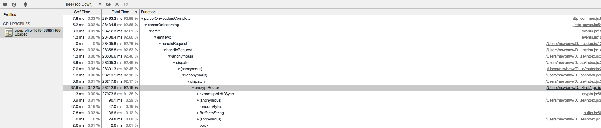
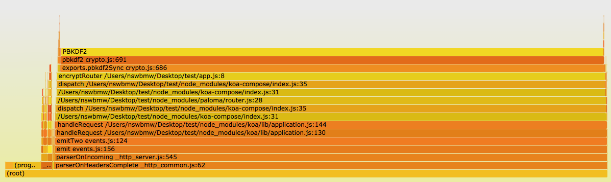
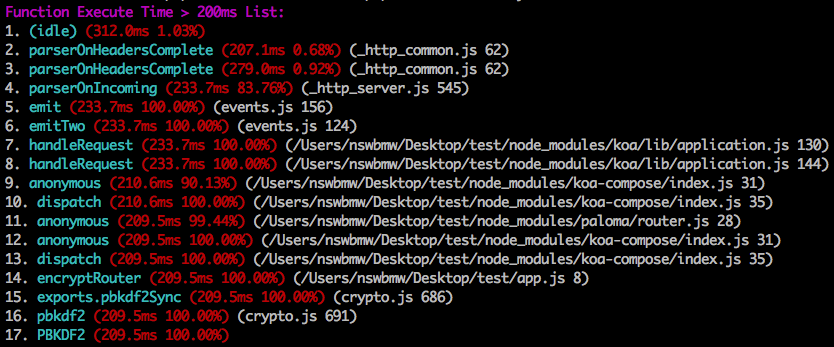

我们知道 Node.js 是基于 V8 引擎的，V8 暴露了一些 profiler api，所以我们可以通过 [v8-profiler](https://github.com/node-inspector/v8-profiler) 收集一些运行时数据（如：CPU 和内存）。本文将介绍如何使用 v8-profiler 分析 CPU 的使用情况。

## v8-profiler

创建测试代码：

**app.js**

```js
const fs = require('fs')
const crypto = require('crypto')
const Bluebird = require('bluebird')
const profiler = require('v8-profiler')
const Paloma = require('paloma')
const app = new Paloma()

app.route({ method: 'GET', path: '/encrypt', controller: function encryptRouter (ctx) {
  const password = ctx.query.password || 'test'
  const salt = crypto.randomBytes(128).toString('base64')
  const encryptedPassword = crypto.pbkdf2Sync(password, salt, 10000, 64, 'sha512').toString('hex')

  ctx.body = encryptedPassword
}})

app.route({ method: 'GET', path: '/cpuprofile', async controller (ctx) {
   //Start Profiling
   profiler.startProfiling('CPU profile')
   await Bluebird.delay(30000)
   //Stop Profiling after 30s
   const profile = profiler.stopProfiling()
   profile.export()
     .pipe(fs.createWriteStream(`cpuprofile-${Date.now()}.cpuprofile`))
     .on('finish', () => profile.delete())
   ctx.status = 204
}})
 
app.listen(3000)
```

`GET /encrypt` 有一个 CPU 密集型计算函数 crypto.pbkdf2Sync，`GET /cpuprofile` 用来收集 30s 的 V8 log 然后 dump 到一个文件。

运行该程序，然后起两个终端。一个运行：

```sh
$ curl localhost:3000/cpuprofile
```

触发 CPU profiling，接着另一个立即运行：

```sh
$ ab -c 20 -n 2000 "http://localhost:3000/encrypt?password=123456"
```

触发 CPU 密集计算。

最后生成 cpuprofile-xxx.cpuprofile 文件，文件内容其实就是一个大的 JSON 对象，大体如下：

```json
{
  "typeId": "CPU",
  "uid": "1",
  "title": "CPU profile",
  "head":
   { "functionName": "(root)",
     "url": "",
     "lineNumber": 0,
     "callUID": 154,
     "bailoutReason": "",
     "id": 1,
     "scriptId": 0,
     "hitCount": 0,
     "children": [ ... ] },
  "startTime": 276245,
  "endTime": 276306,
  "samples": [ ... ],
  "timestamps": [ ... ]
}
```

这个 JSON 对象记录了函数调用栈、路径、时间戳和其他一些信息，samples 节点数组和 timestamps 节点数组中的时间戳是一一对应的，并且 samples 节点数组中的每一个值，其实对应了 head 节点的深度优先遍历 ID。这里我们不深究每个字段的含义，下面我们来看如何可视化这些数据。

## 1. Chrome DevTools

Chrome 自带了分析 CPU profile 日志的工具。打开 Chrome -> 调出开发者工具（DevTools） -> 点击右上角三个点的按钮 -> More tools -> JavaScript Profiler -> Load，加载刚才生成的 cpuprofile 文件。左上角下拉菜单可选三种模式：

1. Chart：显示按时间顺序排列的火焰图
2. Heavy (Bottom Up)：按照函数对性能的影响排列，同时可以检查函数的调用路径
3. Tree (Top Down)：显示调用结构的总体状况，从调用堆栈的顶端开始

这里我们选 Tree (Top Down) 模式，按 Total Time 降序排列。可以看到有三列，分别为：

1. Self Time：函数调用所花的时间，仅包含函数本身的声明，不包含任何子函数执行时间
2. Total Time：函数调用所花的总时间，包含函数本身的声明及所有子函数执行时间
3. Function：函数名及路径，可展开查看子函数

一句话解释：**父函数的 Total Time = 父函数的 Self Time + 所有子函数的 Total Time。**

我们不断地展开，并定位到了 encryptRouter，如下图所示：



**可以看出**：我们定位到了 encryptRouter 这个路由，并且这个路由中 exports.pbkdf2Sync 占据了绝大部分 CPU 时间。

## 2. 火焰图

我们也可以用火焰图来展示 cpuprofile 数据。首先全局安装 flamegraph 这个模块：

```sh
$ npm i flamegraph -g
```

运行以下命令将 cpuprofile 文件生成 svg 文件：

```sh
$ flamegraph -t cpuprofile -f cpuprofile-xxx.cpuprofile -o cpuprofile.svg
```

浏览器打开 cpuprofile.svg，如下所示：



**可以看出**：我们定位到了 app.js 第 8 行，即 encryptRouter 这个路由，并且这个路由中 exports.pbkdf2Sync 占据了绝大部分 CPU 时间。

## 3. v8-analytics

[v8-analytics](https://github.com/hyj1991/v8-analytics) 是社区开源的一个解析 v8-profiler 和 heapdump 等模块生成的 CPU & heap-memory 日志的工具。提供以下功能：

- V8 引擎逆优化或者优化失败的函数标红展示以及优化失败原因展示
- 函数执行时长超过预期标红展示
- 当前项目中可疑的内存泄漏点展示

我们以上述第二条功能为例，使用 v8-analytics 分析 CPU 使用情况。

首先，全局安装 v8-analytics：

```sh
$ npm i v8-analytics -g
```

使用以下命令只查看执行时间大于 200ms 的函数：

```sh
$ va timeout cpuprofile-xxx.cpuprofile 200 --only
```

截图如下：



**可以看出**：我们依然能够定位到 encryptRouter 和 exports.pbkdf2Sync。

## 参考链接

- https://developers.google.com/web/tools/chrome-devtools/rendering-tools/js-execution
- http://www.ebaytechblog.com/2016/06/15/igniting-node-js-flames/
- https://cnodejs.org/topic/58b562f97872ea0864fee1a7
- https://github.com/hyj1991/v8-analytics/blob/master/README_ZH.md

上一节：[1.1 perf + FlameGraph](https://github.com/nswbmw/node-in-debugging/blob/master/1.1%20perf%20%2B%20FlameGraph.md)

下一节：[2.1 gcore + llnode](https://github.com/nswbmw/node-in-debugging/blob/master/2.1%20gcore%20%2B%20llnode.md)
