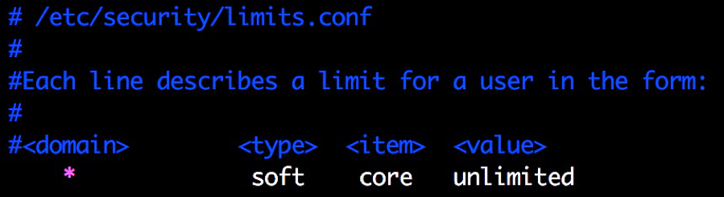

## 2.1.1 Core & Core Dump

在开始之前，我们先了解下什么是 Core 和 Core Dump。

**什么是 Core?**

> 在使用半导体作为内存材料前，人类用线圈作为内存的材料，线圈就叫作 core ，用线圈做的内存就叫作 core memory。如今，半导体工业蓬勃发展，已经没有人用 core memory 了，不过在许多情况下，人们还是把记忆体叫作 core 。

**什么是 Core Dump?**

> 当程序运行的过程中异常终止或崩溃，操作系统会将程序当时的内存状态记录下来，保存在一个文件中，这种行为就叫作 Core Dump（中文翻译成 “核心转储”)。我们可以认为 Core Dump 是 “内存快照”，但实际上，除了内存信息之外，还有些关键的程序运行状态也会同时 dump 下来，例如寄存器信息（包括程序指针、栈指针等）、内存管理信息、其他处理器和操作系统状态和信息。Core Dump 对于编程人员诊断和调试程序是非常有帮助的，因为有些程序中的错误是很难重现的，例如指针异常，而 Core Dump 文件可以再现程序出错时的情景。

**测试环境**

```sh
$ uname -a
Linux nswbmw-VirtualBox 4.13.0-36-generic #40~16.04.1-Ubuntu SMP Fri Feb 16 23:25:58 UTC 2018 x86_64 x86_64 x86_64 GNU/Linux
```

**开启 Core Dump**

在终端中输入：

```sh
$ ulimit -c
```

查看允许 Core Dump 生成的文件的大小，如果是 0 则表示关闭了 Core Dump。使用以下命令开启 Core Dump，并且不限制 Core Dump 生成的文件大小：

```sh
$ ulimit -c unlimited
```

以上命令只在当前终端环境下有效，如果想永久生效，就需要修改 /etc/security/limits.conf 文件，如下：



## 2.1.2 [gcore](http://man7.org/linux/man-pages/man1/gcore.1.html)

使用 gcore 可以不重启程序而 dump 出特定进程的 core 文件。gcore 使用方法如下：

```sh
$ gcore [-o filename] pid
```

在 Core Dump 时，默认会在执行 gcore 命令的目录生成 core.\<PID\> 文件。

## 2.1.3 llnode

什么是 llnode？

> Node.js v4.x+ C++ plugin for [LLDB](http://lldb.llvm.org/) - a next generation, high-performance debugger.

什么是 LLDB？

> LLDB is a next generation, high-performance debugger. It is built as a set of reusable components which highly leverage existing libraries in the larger LLVM Project, such as the Clang expression parser and LLVM disassembler.

安装 llnode + lldb：

```sh
$ sudo apt-get update

# Clone llnode
$ git clone https://github.com/nodejs/llnode.git ~/llnode && cd ~/llnode

# Install lldb and headers
$ sudo apt-get install lldb-4.0 liblldb-4.0-dev

# Initialize GYP
$ git clone https://github.com/bnoordhuis/gyp.git tools/gyp

# Configure
$ ./gyp_llnode -Dlldb_dir=/usr/lib/llvm-4.0/

# Build
$ make -C out/ -j9

# Install
$ sudo make install-linux
```

**注意**：如果 `sudo apt-get update` 遇到这种错误：

```
W: GPG error: xxx stable Release: The following signatures couldn't be verified because the public key is not available: NO_PUBKEY 6DA62DE462C7DA6D
```

可以用以下命令解决：

```sh
$ sudo apt-key adv --keyserver keyserver.ubuntu.com --recv-keys 6DA62DE462C7DA6D
```

--recv-keys 后面跟的是前面报错提示的 PUBKEY。

## 2.1.4 测试 Core Dump

下面用一个典型的全局变量缓存导致的内存泄漏的例子来测试 llnode 的用法。代码如下：

**app.js**

```js
const leaks = []

function LeakingClass() {
  this.name = Math.random().toString(36)
  this.age = Math.floor(Math.random() * 100)
}

setInterval(() => {
  for (let i = 0; i < 100; i++) {
    leaks.push(new LeakingClass)
  }

  console.warn('Leaks: %d', leaks.length)
}, 1000)
```

运行该程序：

```sh
$ node app.js
```

等待几秒，打开另一个终端运行 gcore：

```sh
$ ulimit -c unlimited
$ sudo gcore `pgrep -n node`
```

生成 core.2763 文件。

## 2.1.5 分析 Core 文件

使用 lldb 加载刚才生成的 Core 文件：

```sh
$ lldb-4.0 -c ./core.2763 
(lldb) target create --core "./core.2763"
Core file '/home/nswbmw/test/./core.2763' (x86_64) was loaded.
(lldb) 
```

输入 v8 查看使用文档，有以下几条命令：

- bt
- findjsinstances
- findjsobjects
- findrefs
- inspect
- nodeinfo
- print
- source

运行 `v8 findjsobjects` 查看所有对象实例及总共占内存大小：

```
(lldb) v8 findjsobjects
 Instances  Total Size Name
 ---------- ---------- ----
       ...
       2100      84000 LeakingClass
       8834      39792 (String)
 ---------- ---------- 
      12088     181320 
```

**可以看出**：LeakingClass 有 2100 个实例，占内存 84000 byte。使用 `v8 findjsinstances` 查看所有 LeakingClass 实例：

```
(lldb) v8 findjsinstances LeakingClass
0x000022aaa118ab19:<Object: LeakingClass>
0x000022aaa118acf9:<Object: LeakingClass>
0x000022aaa118ade1:<Object: LeakingClass>
...
```

使用 `v8 i` 检索实例的具体内容：

```
(lldb) v8 i 0x000022aaa118ab19
0x000022aaa118ab19:<Object: LeakingClass properties {
    .name=0x000022aaa118ab91:<String: "0.4tx00cipe8">,
    .age=<Smi: 71>}>
(lldb) v8 i 0x000022aaa118acf9
0x000022aaa118acf9:<Object: LeakingClass properties {
    .name=0x000022aaa118ad71:<String: "0.48563ixsblf">,
    .age=<Smi: 70>}>
(lldb) v8 i 0x000022aaa118ade1
0x000022aaa118ade1:<Object: LeakingClass properties {
    .name=0x000022aaa118ae59:<String: "0.w1nel407zj">,
    .age=<Smi: 80>}>
```

可以看到每个 LeakingClass 实例的 name 和 age 字段的值。

使用 `v8 findrefs` 查看引用：

```
(lldb) v8 findrefs 0x000022aaa118ab19
0x22aaa1189729: (Array)[0]=0x22aaa118ab19
(lldb) v8 i 0x22aaa1189729
0x000022aaa1189729:<Array: length=2100 {
    [0]=0x000022aaa118ab19:<Object: LeakingClass>,
    [1]=0x000022aaa118acf9:<Object: LeakingClass>,
    [2]=0x000022aaa118ade1:<Object: LeakingClass>,
    [3]=0x000022aaa118aea1:<Object: LeakingClass>,
    [4]=0x000022aaa118af61:<Object: LeakingClass>,
    [5]=0x000022aaa118b021:<Object: LeakingClass>,
    [6]=0x000022aaa118b0e1:<Object: LeakingClass>,
    [7]=0x000022aaa118b1a1:<Object: LeakingClass>,
    [8]=0x000022aaa118b221:<Object: LeakingClass>,
    [9]=0x000022aaa118b2a1:<Object: LeakingClass>,
    [10]=0x000022aaa118b321:<Object: LeakingClass>,
    [11]=0x000022aaa118b3a1:<Object: LeakingClass>,
    [12]=0x000022aaa118b421:<Object: LeakingClass>,
    [13]=0x000022aaa118b4a1:<Object: LeakingClass>,
    [14]=0x000022aaa118b521:<Object: LeakingClass>,
    [15]=0x000022aaa118b5a1:<Object: LeakingClass>}>
```

**可以看出**：通过一个 LeakingClass 实例的内存地址，我们使用 `v8 findrefs` 找到了引用它的数组的内存地址，然后通过这个地址去检索数组，得到这个数组长度为 2100，每一项都是一个 LeakingClass 实例，这不就是我们代码中的 leaks 数组吗？

**小提示**: `v8 i` 是 `v8 inspect` 的缩写，`v8 p` 是 `v8 print` 的缩写。

## 2.1.6 --abort-on-uncaught-exception

在 Node.js 程序启动时添加 --abort-on-uncaught-exception 参数，当程序 crash 的时候，会自动 Core Dump，方便 “死后验尸”。

添加 --abort-on-uncaught-exception 参数，启动测试程序：

```sh
$ ulimit -c unlimited
$ node --abort-on-uncaught-exception app.js
```

启动另外一个终端运行：

```sh
$ kill -BUS `pgrep -n node`
```

第 1 个终端会显示：

```sh
Leaks: 100
Leaks: 200
Leaks: 300
Leaks: 400
Leaks: 500
Leaks: 600
Leaks: 700
Leaks: 800
Bus error (core dumped)
```

调试步骤与上面一致：

```sh
$ lldb-4.0 -c ./core
(lldb) target create --core "./core"
Core file '/home/nswbmw/test/./core' (x86_64) was loaded.
(lldb) v8 findjsobjects
 Instances  Total Size Name
 ---------- ---------- ----
        ...
        800      32000 LeakingClass
       7519      38512 (String)
 ---------- ---------- 
       9440     126368
```

## 2.1.7 总结

我们的测试代码很简单，没有引用任何第三方模块，如果项目较大且引用的模块较多，则 `v8 findjsobjects` 的结果将难以甄别，这时可以多次使用 gcore 进行 Core Dump，对比发现增长的对象，再进行诊断。

## 2.1.8 参考链接

- http://www.cnblogs.com/Anker/p/6079580.html
- http://www.brendangregg.com/blog/2016-07-13/llnode-nodejs-memory-leak-analysis.html

上一节：[1.3 Tick Processor](https://github.com/nswbmw/node-in-debugging/blob/master/1.3%20Tick%20Processor.md)

下一节：[2.2 heapdump](https://github.com/nswbmw/node-in-debugging/blob/master/2.2%20heapdump.md)
