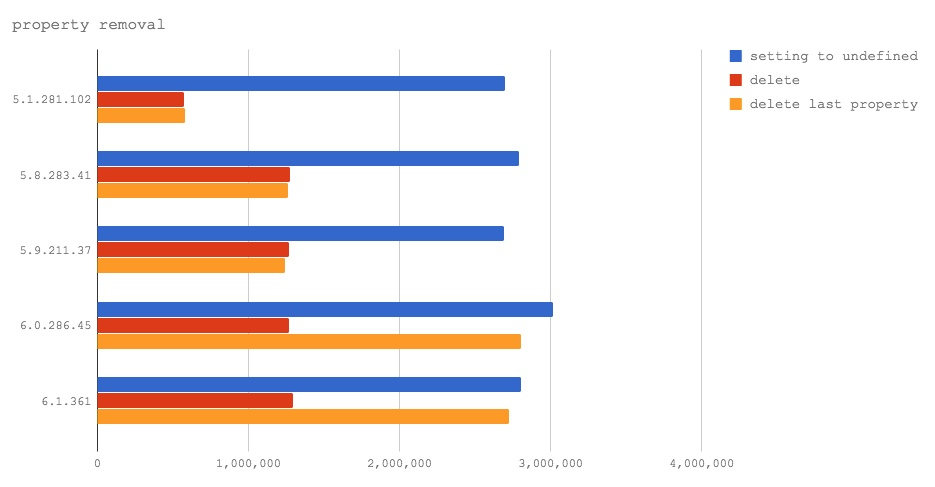
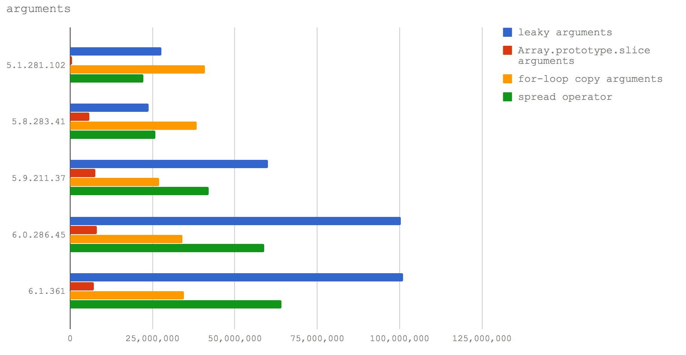
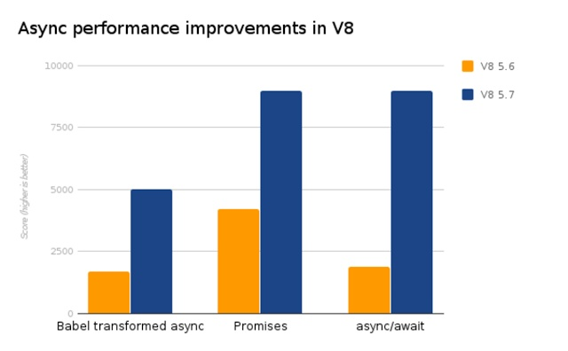
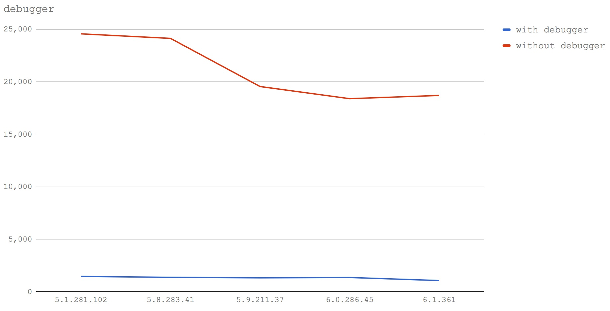

如果你想以最简单的方式提升 Node.js 程序的性能，那就升级到 node@8+ 吧。这不是一个玩笑，多少 JavaScript 前辈们以血的教训总结出了一长列 “Optimization killers”，典型的有：

1. 在 try 里面不要写过多代码，V8 无法优化，最好将这些代码放到一个函数里，然后 try 这个函数。
2. 少用 delete。
3. 少用 arguments。
4. ...

然而，随着 V8 彻底换上了新的 JIT 编译器—— Turbofan，大多数 “Optimization killers” 都已经成了过去时。所以在本节中我们来看看哪些过去常见的 “Optimization killers” 已经可以被 V8 优化。

## 3.4.1 Ignition + Turbofan

之前 V8 使用的是名为 Crankshaft 的编译器，这个编译器后来逐渐暴露出一些缺点：

1. Doesn’t scale to full, modern JavaScript (try-catch, for-of, generators, async/await, …)
2. Defaults to deoptimization (performance cliffs, deoptimization loops)
3. Graph construction, inlining and optimization all mixed up
4. Tight coupling to fullcodegen / brittle environment tracking
5. Limited optimization potential / limited static analysis (i.e. type propagation)
6. High porting overhead
7. Mixed low-level and high-level semantics of instructions

而引入 Turbofan 的好处是：

1. Full ESnext language support (try-catch/-finally, class literals, eval, generators, async functions, modules, destructuring, etc.)
2. Utilize and propagate (static) type information
3. Separate graph building from optimization / inlining
4. No deoptimization loops / deoptimization only when really beneficial
5. Sane environment tracking (also for lazy deoptimization)
6. Predictable peak performance

Ignition 是 V8 新引入的解释器，用来将代码编译成简洁的字节码，而不是之前的机器码，这大大减少了结果代码，减少了系统的内存使用。由于字节码较小，所以可以编译全部源代码，而不用避免编译未使用的代码。也就是说，脚本只需要解析一次，而不是像之前的编译过程那样解析多次。

Ignition 与 TurboFan 的关系为：Ignition 解释器使用低级的、体系结构无关的 TurboFan 宏汇编指令为每个操作码生成字节码处理程序，TurboFan 将这些指令编译成目标平台的代码，并在这个过程中执行低级的指令选择和机器寄存器分配。

补充一点，之前的 V8 将代码编译成机器码执行，而新的 V8 将代码编译成字节码解释执行，动机是什么呢？可能是：

1. 减少机器码占用的内存空间，即牺牲时间换空间（主要动机）。
2. 加快代码的启动速度。
3. 对 V8 的代码进行重构，降低 V8 的代码复杂度。

## 3.4.2 版本对应关系

```
node@6       -> V8@5.1 -> Crankshaft
node@8.0-8.2 -> V8@5.8 -> Crankshaft + Turbofan
                V8@5.9 -> Turbofan
node@8.3-8.4 -> V8@6.0 -> Turbofan
```

## 3.4.3 try/catch

最著名的去优化之一是使用 try/catch 代码块。下面通过 4 种场景比较在不同的 V8 版本下执行的效率：

```js
var benchmark = require('benchmark')
var suite = new benchmark.Suite()

function sum (base, max) {
  var total = 0

  for (var i = base; i < max; i++) {
    total += i
  }
}

suite.add('sum with try catch', function sumTryCatch () {
  try {
    var base = 0
    var max = 65535

    var total = 0

    for (var i = base; i < max; i++) {
      total += i
    }
  } catch (err) {
    console.log(err.message)
  }
})

suite.add('sum without try catch', function noTryCatch () {
  var base = 0
  var max = 65535

  var total = 0

  for (var i = base; i < max; i++) {
    total += i
  }
})

suite.add('sum wrapped', function wrapped () {
  var base = 0
  var max = 65535

  try {
    sum(base, max)
  } catch (err) {
    console.log(err.message)
  }
})

suite.add('sum function', function func () {
  var base = 0
  var max = 65535

  sum(base, max)
})

suite.on('complete', require('./print'))
suite.run()
```

运行结果如下：


**结论**：在 node@8.3 及以上版本中，在 try 块内写代码的性能损耗可以忽略不计。

## 3.4.4 delete

多年以来，delete 对于任何希望编写高性能 JavaScript 的人来说都是受限制的，我们通常用赋值 undefined 替代。delete 的问题归结为 V8 处理 JavaScript 对象的动态特性和原型链方式，使得属性查找在实现上变得复杂。下面通过 3 种场景比较在不同的 V8 版本下执行的效率：

```js
var benchmark = require('benchmark')
var suite = new benchmark.Suite()

function MyClass (x, y) {
  this.x = x
  this.y = y
}

function MyClassLast (x, y) {
  this.y = y
  this.x = x
}

suite.add('setting to undefined', function undefProp () {
  var obj = new MyClass(2, 3)
  obj.x = undefined

  JSON.stringify(obj)
})

suite.add('delete', function deleteProp () {
  var obj = new MyClass(2, 3)
  delete obj.x

  JSON.stringify(obj)
})

suite.add('delete last property', function deleteProp () {
  var obj = new MyClassLast(2, 3)
  delete obj.x

  JSON.stringify(obj)
})

suite.add('setting to undefined literal', function undefPropLit () {
  var obj = { x: 2, y: 3 }
  obj.x = undefined

  JSON.stringify(obj)
})

suite.add('delete property literal', function deletePropLit () {
  var obj = { x: 2, y: 3 }
  delete obj.x

  JSON.stringify(obj)
})

suite.add('delete last property literal', function deletePropLit () {
  var obj = { y: 3, x: 2 }
  delete obj.x

  JSON.stringify(obj)
})

suite.on('complete', require('./print'))
suite.run()
```

运行结果如下：



**结论**：在 node@8 及以上版本中，delete 一个对象上的属性比 node@6 快了一倍。在 node@8.3 及以上版本中，delete 一个对象上最后一个属性几乎与赋值 undefined 同样快了。

## 3.4.5 arguments

我们知道 arguments 是个类数组，所以通常我们要使用 `Array.prototype.slice.call(arguments)` 将它转化成数组再使用，这样会有一定的性能损耗。下面通过 4 种场景比较在不同的 V8 版本下执行的效率：

```js
var benchmark = require('benchmark')
var suite = new benchmark.Suite()

function leakyArguments () {
  return other(arguments)
}

function copyArgs () {
  var array = new Array(arguments.length)

  for (var i = 0; i < array.length; i++) {
    array[i] = arguments[i]
  }

  return other(array)
}

function sliceArguments () {
  var array = Array.prototype.slice.apply(arguments)
  return other(array)
}

function spreadOp(...args) {
  return other(args)
}

function other (toSum) {
  var total = 0
  for (var i = 0; i < toSum.length; i++) {
    total += toSum[i]
  }
  return total
}

suite.add('leaky arguments', () => {
  leakyArguments(1, 2, 3)
})

suite.add('Array.prototype.slice arguments', () => {
  sliceArguments(1, 2, 3)
})

suite.add('for-loop copy arguments', () => {
  copyArgs(1, 2, 3)
})

suite.add('spread operator', () => {
  spreadOp(1, 2, 3)
})

suite.on('complete', require('./print'))
suite.run()
```

运行结果如下：



**结论**：在 node@8.3 及以上版本中，使用对象展开运算符是除直接使用 arguments 外最快的方案，对于 node@8.2 及以下的版本，我们应该使用一个 for 循环将 key 从 arguments 复制到一个新的（预先分配的）数组中。总之，是时候抛弃 Array.prototype.slice.call 了。

## 3.4.6 async 性能提升

在 V8@5.7 发布后，原生的 async 函数与 Promise 一样快了，同时，Promise 的性能也比 V8@5.6 快了一倍。如图所示：



## 3.4.7 不会优化的特性

并不是说上了 Turbofan 就能优化所有的 JavaScript 语法，有些语法 V8 是不会去优化的（也没有必要），例如：

1. debugger
2. eval
3. with

我们以 debugger 为例，比较使用和不使用 debugger 时的性能：

```js
var benchmark = require('benchmark')
var suite = new benchmark.Suite()

suite.add('with debugger', function withDebugger () {
  var base = 0
  var max = 65535

  var total = 0

  for (var i = base; i < max; i++) {
    debugger
    total += i
  }
})

suite.add('without debugger', function withoutDebugger () {
  var base = 0
  var max = 65535

  var total = 0

  for (var i = base; i < max; i++) {
    total += i
  }
})

suite.on('complete', require('./print'))
suite.run()
```

运行结果如下：



**结论**：在所有测试的 V8 版本中，debugger 一直都很慢，所以记得在打断点测试完后一定要删掉 debugger。

## 3.4.8 总结

1. 使用最新 LTS 版本的 Node.js。
2. 关注 V8 团队的博客——[https://v8project.blogspot.com](https://v8project.blogspot.com/)，了解第一手资讯。
3. 清晰的代码远比使用一些奇技淫巧提升的一点性能重要得多。

## 3.4.9 参考链接

- https://github.com/davidmarkclements/v8-perf
- http://www.infoq.com/cn/news/2016/08/v8-ignition-javascript-inteprete
- <https://docs.google.com/presentation/d/1H1lLsbclvzyOF3IUR05ZUaZcqDxo7_-8f4yJoxdMooU/edit#slide=id.g18ceb14729_0_59>
- https://www.nearform.com/blog/node-js-is-getting-a-new-v8-with-turbofan
- https://zhuanlan.zhihu.com/p/26669846

上一节：[3.3 Error Stack](https://github.com/nswbmw/node-in-debugging/blob/master/3.3%20Error%20Stack.md)

下一节：[3.5 Rust Addons](https://github.com/nswbmw/node-in-debugging/blob/master/3.5%20Rust%20Addons.md)
