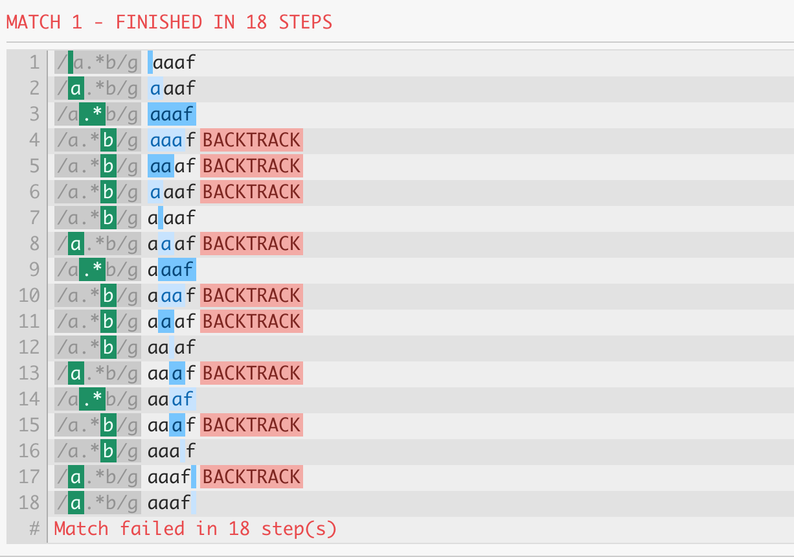

相信所有 Node.js 开发者都对 `TypeError: Cannot read property 'xxx' of undefined/null` 这种错误并不陌生，这是因为期望从一个对象上获取 xxx 属性，结果这个对象的值是 undefined 或者 null。

## 3.7.1 uncaughtException

看一段代码：

```js
const article = { title: 'Node.js', content: 'Hello, Node.js' }
setImmediate(() => {
  console.log(article.author.name)
})
```

运行以上代码打印出：

```
/Users/nswbmw/Desktop/test/app.js:3
  console.log(article.author.name)
                             ^
TypeError: Cannot read property 'name' of undefined
    at Timeout.setInterval [as _onTimeout] (/Users/nswbmw/Desktop/test/app.js:3:30)
    at ontimeout (timers.js:475:11)
    at tryOnTimeout (timers.js:310:5)
    at Timer.listOnTimeout (timers.js:270:5)
```

article 是一个文章对象有 title 和 content 属性，没有 author 属性，所以 article.author 是 undefined，调用 article.author.name 会报错。而且这个运行时错误是在一个异步函数（setImmediate）内抛出的，所以这个错误是一个 “uncaught exception”，如果没有 process.on('uncaughtException', () => {}) 事件监听器的话程序会 crash。

调试这种错误没有比较好的方法，通常只能添加 console.log 打印出 article 的值。但是我们前面介绍过 llnode 的用法，是否可以使用 llnode 调试这类问题呢？答案是肯定的。

## 3.7.2 llnode

我们添加 --abort-on-uncaught-exception 参数重新运行程序，当程序 crash 的时候，会自动 Core Dump。

```sh
$ ulimit -c unlimited
$ node --abort-on-uncaught-exception app.js
Uncaught TypeError: Cannot read property 'name' of undefined

FROM
Immediate.setImmediate (/home/nswbmw/test/app.js:1:1)
runCallback (timers.js:1:1)
tryOnImmediate (timers.js:1:1)
processImmediate [as _immediateCallback] (timers.js:1:1)
Illegal instruction (core dumped)
```

此时生成一个 core 文件，我们使用 llnode 加载并诊断这个 core 文件。

```sh
$ lldb-4.0 -c ./core
(lldb) target create --core "./core"
Core file '/home/nswbmw/test/./core' (x86_64) was loaded.
(lldb)
```

使用 `v8 bt` 查看最近的 backtrace。

```sh
(lldb) v8 bt
 * thread #1: tid = 4750, 0x00007ffd905d5b39 node`v8::base::OS::Abort() + 9, name = 'node', stop reason = signal SIGILL
  * frame #0: 0x00007ffd905d5b39 node`v8::base::OS::Abort() + 9
    frame #1: 0x00007ffd900a4d19 node`v8::internal::Isolate::Throw(v8::internal::Object*, v8::internal::MessageLocation*) + 489
    frame #2: 0x00007ffd9005e7f9 node`v8::internal::LoadIC::Load(v8::internal::Handle<v8::internal::Object>, v8::internal::Handle<v8::internal::Name>) + 569
    frame #3: 0x00007ffd9005f759 node`v8::internal::Runtime_LoadIC_Miss(int, v8::internal::Object**, v8::internal::Isolate*) + 633
    frame #4: 0x000018e6e710463d <exit>
    frame #5: 0x000018e6e71ecce4 <stub>
    frame #6: 0x000018e6e71bf9ce setImmediate(this=0x0000154a3ae09429:<Object: Immediate>) at /home/nswbmw/test/app.js:2:14 fn=0x0000154a3ae09281
    ...
```

**可以看出**：在 frame #4 处程序触发 exit，往上追溯到 frame #6 有一个 setImmediate 抛出了错误，在 app.js 第 2 行，符合打印出的错误信息。setImmediate 的回调函数的地址为 0x0000154a3ae09281，我们使用 `v8 i` 检索这个函数。

```sh
(lldb) v8 i 0x0000154a3ae09281
0x0000154a3ae09281:<function: setImmediate at /home/nswbmw/test/app.js:2:14
  context=0x0000154a3ae09199{
    (previous)=0x000017849b703d89
    (closure)=0x0000154a3ae08d81 {<function: (anonymous) at /home/nswbmw/test/app.js:1:10>},
    article=0x0000154a3ae091d1:<Object: Object>}>
(lldb) v8 i 0x0000154a3ae091d1
0x0000154a3ae091d1:<Object: Object properties {
    .title=0x000014117e04c9e9:<String: "Node.js">,
    .content=0x000014117e04ca09:<String: "Hello, Node.js">}>
```

setImmediate 函数内有一个 article 对象，然后我们继续通过 `v8 i` 检索得知 article 的值为 { title: "Node.js", content: "Hello, Node.js" }，并没有 author 属性，真相大白。

## 3.7.3 ReDoS

DoS（Denial of Service）全称是拒绝服务攻击，ReDoS（RegExp Denial of Service）即是正则表达式拒绝服务攻击。ReDoS 是由于正则表达式写得有缺陷，所以使用正则匹配时，会出现大量占用 CPU 的情况，导致服务不可用，而导致正则表达式匹配 “卡住” 的原因正是正则表达式的 “回溯” 特性。

看一个简单的例子：

```js
/a.*b/g.test('aaaf')
```

匹配过程如下：



**可以看出**：因为 * 是贪婪匹配，所以第 3 步 `.*` 匹配了字符串末尾，由于剩下一个 `b` 无法匹配所以 “吐” 出一个字符再尝试匹配（第 4 步），仍然不匹配（第 5 步），继续 “吐” 出一个字符…这个 “吐” 一个字符的过程就是回溯（backtrack）。

再看个例子：

```js
const reg = /(a*)+b/

console.time('reg')
reg.test('aaaaaaaaaaaaaaaaaaaaaaaaaaaf') // reg: 2572.022ms
// reg.test('aaaaaaaaaaaaaaaaaaaaaaaaaaaf') // reg: 5048.735ms
// reg.test('aaaaaaaaaaaaaaaaaaaaaaaaaaaf') // reg: 10710.070ms
console.timeEnd('reg')
```

运行以上代码，每添加一个字母 a，程序的运行时间就翻倍，这正是由于正则表达式的回溯导致的，这个正则表达式的时间复杂度为 O(2^n)。

平时写出具有回溯的正则表达式是比较常见的，这个时候程序会 “卡住”，使用 llnode 也可以调试这类问题。

运行以下代码：

```sh
$ echo "/(a*)+b/.test('aaaaaaaaaaaaaaaaaaaaaaaaaaaaaf')" > app.js
$ node --abort-on-uncaught-exception app.js &
$ kill -BUS `pgrep -n node`
```

生成 core 文件，使用 llnode 调试。

```sh
$ lldb-4.0 -c ./core
(lldb) target create --core "./core"
Core file '/home/nswbmw/test/./core' (x86_64) was loaded.
(lldb) v8 bt
 * thread #1: tid = 5381, 0x000036a6db804f6b, name = 'node', stop reason = signal SIGBUS
  * frame #0: 0x000036a6db804f6b <builtin>
    ...
    frame #6: 0x000036a6db68463d <exit>
    frame #7: 0x000036a6db7135f4 test(this=0x0000038344709119:<JSRegExp source=/(a*)+b/>, 0x0000098ccdb4c9e9:<String: "aaaaaaaaaaaaaaaa...">) at (no script) fn=0x0000183ca0c134a1
    ...
(lldb) v8 i -F 0x0000098ccdb4c9e9
0x0000098ccdb4c9e9:<String: "aaaaaaaaaaaaaaaaaaaaaaaaaaaaaf">
```

**可以看出**：在程序退出前，程序在执行一个正则表达式（`/(a*)+b/`）的 test 方法，参数是字符串(`aaaaaaaaaaaaaaaaaaaaaaaaaaaaaf`)。

减少正则表达式回溯的简单方法就是合并不必要的量词，如将上面的正则表达式 `/(a*)+b/` 修改为 `/a*b/`。

## 3.7.4 参考链接

- https://www.rawidn.com/posts/ddos-and-ddos-in-regular-expression.html

上一节：[3.6 Event Loop](https://github.com/nswbmw/node-in-debugging/blob/master/3.6%20Event%20Loop.md)

下一节：[4.1 Source Map](https://github.com/nswbmw/node-in-debugging/blob/master/4.1%20Source%20Map.md)
