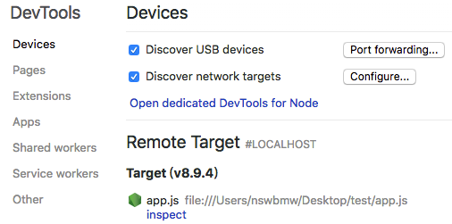
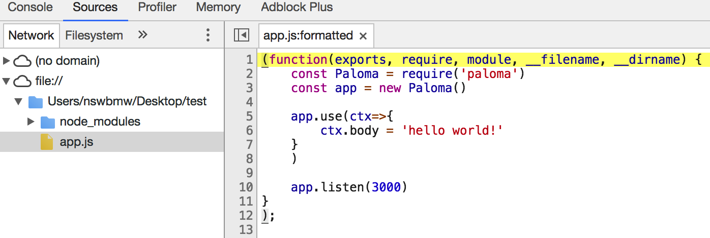
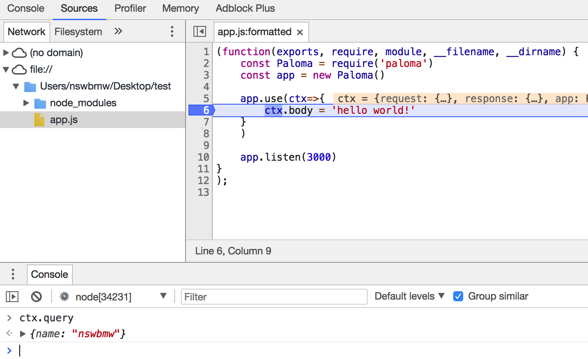
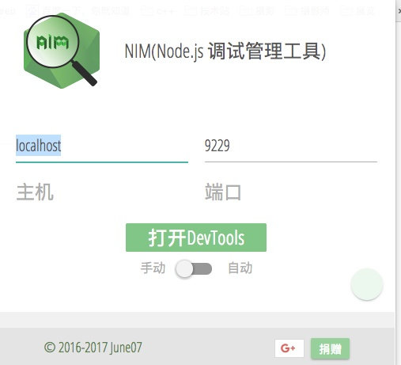

调试是每个程序员必备的技能，因此选择合适的调试工具能极大的方便我们调试代码。Node.js 的调试方式也有很多，常见的如：

1. 万能的 console.log
2. debugger
3. node-inspector

以上本文都不会涉及，因为：

1. console.log 就不用说了
2. debugger 不推荐使用，因为：
   1. 使用繁琐，需手动打点
   2. 若忘记删除 debugger，会引起性能问题
3. node-inspector 已经退出历史舞台。node@6.3 以后，Node.js 内置了一个调试器，可以结合 Chrome DevTools 使用，而且比 node-inspector 更强大

下面就讲讲 Chrome DevTools 的用法。

## Chrome DevTools

创建示例代码：

**app.js**

```js
const Paloma = require('paloma')
const app = new Paloma()

app.use(ctx => {
  ctx.body = 'hello world!'
})

app.listen(3000)
```

运行：

```sh
$ node --inspect app.js
```

**注意**：如果想让代码在第一行就暂停执行，需要使用 --inspect-brk 参数启动，即 `node --inspect-brk app.js`。

打开 Chrome 浏览器，访问 chrome://inspect，如下所示：



点击 Remote Target 下的 inspect，选择 Sources，如下所示：



使用方式跟 node-inspector 类似，可以添加断点，然后在 Console 里面直接输入变量名打印该变量的值。如下所示，在第 6 行添加断点，然后通过 `curl localhost:3000?name=nswbmw`，代码执行到第 6 行暂停执行，在 Console 里打印 ctx.query 的值：



**Tips**：将鼠标悬浮在某个变量上，也会显示它的值，如：ctx。

展开右侧的 debugger 有更多的功能，如单步执行、单步进入、单步退出等等，这里不再详细讲解。

## [NIM](https://chrome.google.com/webstore/detail/nim-node-inspector-manage/gnhhdgbaldcilmgcpfddgdbkhjohddkj)

每次调试 Node.js 都要打开隐藏那么深的入口烦不烦？还好我们有 [NIM](https://chrome.google.com/webstore/detail/nim-node-inspector-manage/gnhhdgbaldcilmgcpfddgdbkhjohddkj)。NIM（Node Inspector Manager）是一个 Chrome 插件，可以方便我们快捷的打开 DevTools，也可以设置自动发现并打开 DevTools。



## [inspect-process](https://github.com/jaridmargolin/inspect-process)

NIM 也麻烦？那你可能需要 [inspect-process](https://github.com/jaridmargolin/inspect-process)。

全局安装：

```sh
$ npm i inspect-process -g
```

使用：

```sh
$ inspect app.js
```

inspect-process 会自动调起 Chrome DevTools，然后定位到 app.js，其余用法跟 Chrome DevTools 一致。

## process._debugProcess

如果一个 Node.js 进程已经启动，没有添加 --inspect 参数，我们不想重启（会丢失现场）又想调试怎么办？幸好我们有 process._debugProcess。使用方法：

1. 通过 ps 命令或者 `pgrep -n node` 查看当前启动的 Node.js 进程的 pid，如：53911
2. 打开新的终端，运行：`node -e "process._debugProcess(53911)"`，原来的 Node.js 进程会打印出：Debugger listening on ws://127.0.0.1:9229/2331fa07-32af-45eb-a1a8-bead7a0ab905
3. 调出 Chrome DevTools 进行调试

## 参考链接

- [https://medium.com/@paul_irish/debugging-node-js-nightlies-with-chrome-devtools-7c4a1b95ae27](https://medium.com/@paul_irish/debugging-node-js-nightlies-with-chrome-devtools-7c4a1b95ae27)

上一节：[4.1 Source Map](https://github.com/nswbmw/node-in-debugging/blob/master/4.1%20Source%20Map.md)

下一节：[4.3 Visual Studio Code](https://github.com/nswbmw/node-in-debugging/blob/master/4.3%20Visual%20Studio%20Code.md)
