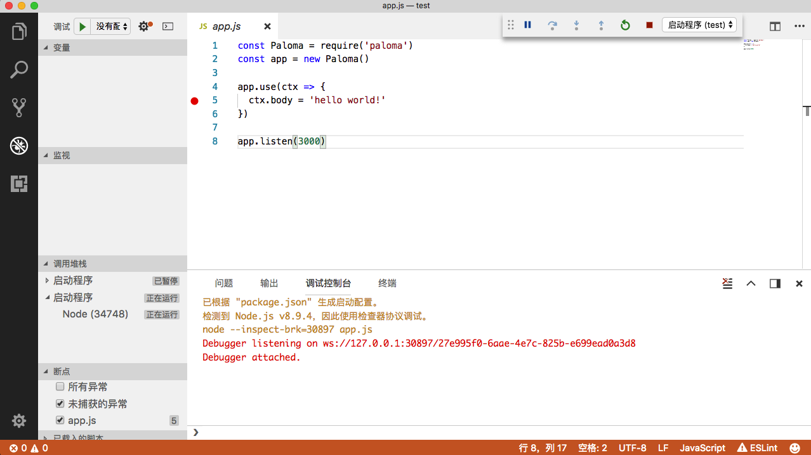
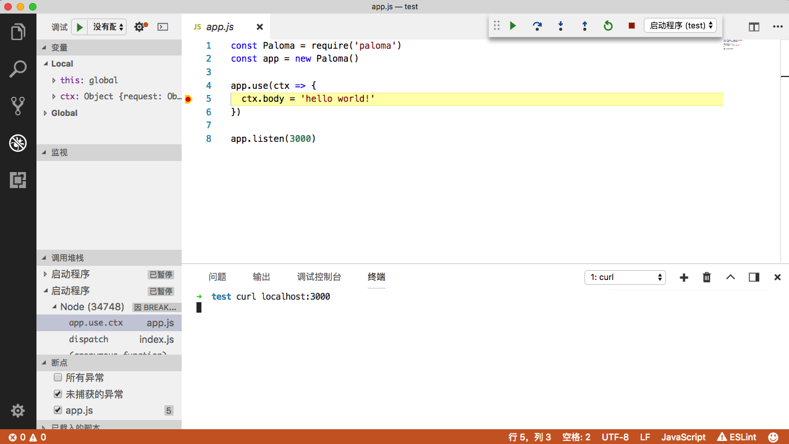
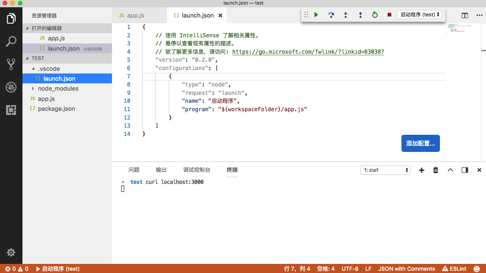
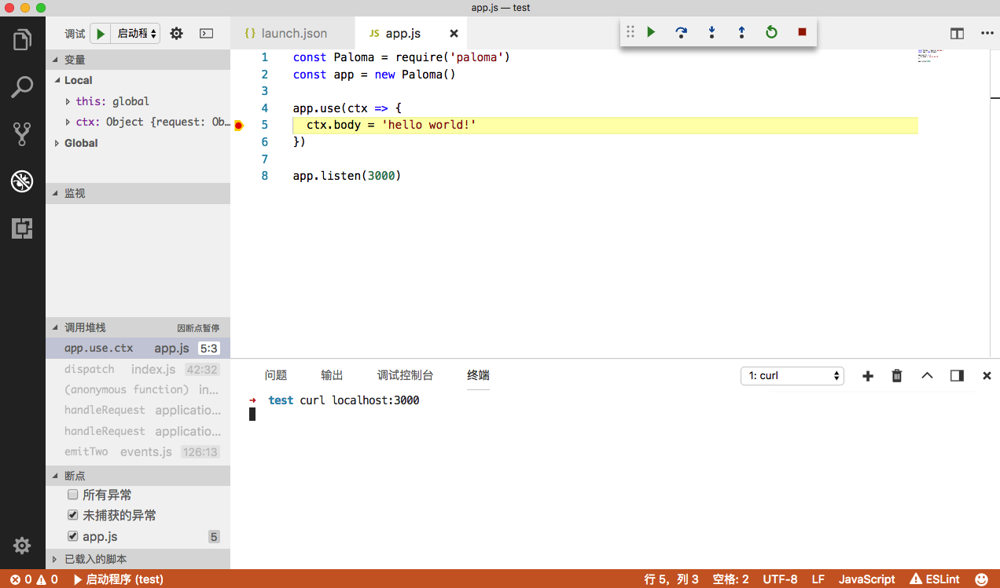
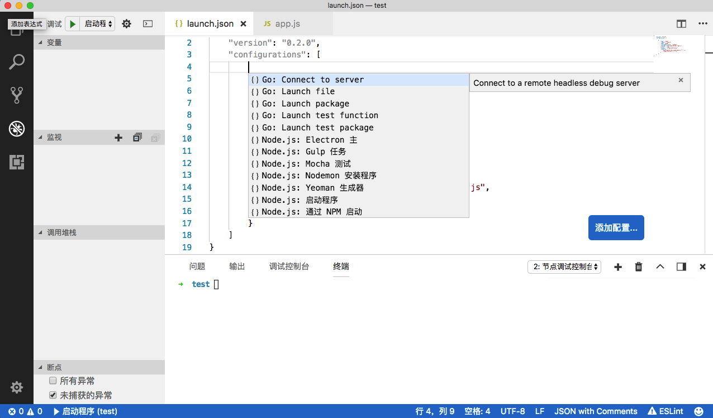

Visual Studio Code（简称 VS Code）是一款微软开源的现代化、跨平台、轻量级的代码编辑器。VS Code 很好很强大，本文将介绍如何使用 VS Code 来调试 Node.js 代码。

## 基本调试

示例代码：

**app.js**

```js
const Paloma = require('paloma')
const app = new Paloma()

app.use(ctx => {
  ctx.body = 'hello world!'
})

app.listen(3000)
```

用 VS Code 加载 test 文件夹，打开 app.js，然后：

1. 点击左侧第 4 个 tab 切换到调试模式
2. 点击代码第 5 行  `ctx.body='hello world!'` 左侧空白处添加断点
3. 点击左上角『调试』的绿色三角按钮启动调试
4. 点击左上角终端图标打开调试控制台

最终如下所示：



从『调试控制台』切换到『终端』，运行：

```sh
$ curl localhost:3000
```

如下所示：



可以看出，VS Code 基本覆盖了 Chrome DevTools 所有的功能，并且有两个额外的优点：

1. 集成了终端，不用再打开新的终端输入命令了
2. 调试动作里添加了『重启』和『停止』按钮，不用每次修改完代码切回终端去重启了

但 VS Code 的强大远不止如此，通过 launch.json 可以配置详细的调试功能。

## launch.json

上图可以看出，『调试』右边有个下拉菜单，默认是『没有配置』。点击右侧的齿轮状图标，会在项目根目录下创建 .vscode 文件夹及 launch.json 文件。launch.json 内容如下：



这个默认配置的意思是执行：

```sh
$ node ${workspaceFolder}/app.js
```

launch.json 其实就是存储了一些调试相关的配置，VS Code 启动调试时，会读取 launch.json 决定以何种方式调试。launch.json 有以下常用选项：

必需字段：

- type：调试器类型。这里是 node（内置的调试器），如果装了 Go 和 PHP 的扩展后对应的 type 分别为 go 和 php
- request：请求的类型，支持 launch 和 attach。launch 就是以 debug 模式启动调试，attach 就是附加到已经启动的进程开启 debug 模式并调试，跟上一小节提到的用 `node -e "process._debugProcess(PID)"` 作用一样
- name：下拉菜单显示的名字

可选字段（括号里表示适用的类型）：

- program：可执行文件或者调试器要运行的文件 (launch)
- args：要传递给调试程序的参数 (launch)
- env：环境变量 (launch)
- cwd：当前执行目录 (launch)
- address：ip 地址 (launch & attach)
- port：端口号 (launch & attach)
- skipFiles：想要忽略的文件，数组类型 (launch & attach)
- processId：进程 PID (attach)
- ...

变量替换：

- ${workspaceFolder}：当前打开工程的路径
- ${file}：当前打开文件的路径
- ${fileBasename}：当前打开文件的名字，包含后缀名
- ${fileDirname}：当前打开文件所在的文件夹的路径
- ${fileExtname}：当前打开文件的后缀名
- ${cwd}：当前执行目录
- ...

如果当前打开的文件是 app.js，则以下配置跟默认配置是等效的：

```json
{
    "version": "0.2.0",
    "configurations": [
        {
            "type": "node",
            "request": "launch",
            "name": "启动程序",
            "program": "${file}"
        }
    ]
}
```

更多 launch.json 选项请查阅：

- [Debugging in Visual Studio Code](https://code.visualstudio.com/docs/editor/debugging#_launchjson-attributes)
- [Debug Node.js Apps using VS Code](https://code.visualstudio.com/docs/nodejs/nodejs-debugging#_launch-configuration-attributes)

下面以 5 个实用的技巧讲解部分 launch.json 配置的作用。

## 技巧 1——条件断点

VS Code 可以添加条件断点，即执行到该行代码满足特定条件后程序才会中断。在断点小红点上右键选择『编辑断点』，可以选择两种条件：

1. 表达式：当表达式计算结果为 true 时中断，如设置：`ctx.query.name === 'nswbmw'`，表示当访问 `localhost:3000?name=nswbmw` 时断点才会生效，其余请求断点无效
2. 命中次数：同样当表达式计算结果为 true 时中断，支持运算符 <, <=, ==, >, >=, %。如：
    1. \>10：执行 10 次以后断点才会生效
    2. <3：只有前 2 次断点会生效
    3. 10：等价于 >=10
    4. %2：隔一次中断一次

**注意**：可以组合表达式和命中次数条件一起使用。在切换条件类型时，需要将原来的条件清空，否则会添加两种条件。将鼠标悬浮在断点上，可以查看设置了哪些条件。

## 技巧 2——skipFiles

从上面图中可以看到 VS Code 左侧有一个『调用堆栈』面板，显示了当前断点的调用堆栈，但无法直观的看出哪些是我们项目的代码，哪些是 node_moduels 里模块的代码，而且在点击单步调试时会进入到 node_modules 里。总之，我们不关心 node_modules 里的代码，我们只关心项目本身的代码。这个时候，skipFiles 就派上用场了。

skipFiles 顾名思义就是忽略我们不关心的文件。修改 launch.json 如下：

```json
{
    "version": "0.2.0",
    "configurations": [
        {
            "type": "node",
            "request": "launch",
            "name": "启动程序",
            "program": "${workspaceFolder}/app.js",
            "skipFiles": [
                "${workspaceFolder}/node_modules/**/*.js",
                "<node_internals>/**/*.js"
            ]
        }
    ]
}
```

有几点需要解释：

1. 支持 ${xxx} 这种变量替换
2. 支持 glob 模式匹配
3. <node_internals> 用来忽略 Node.js 核心模块

重启调试后，如下所示：



**可以看出**：左侧『调用堆栈』中我们不关心的调用栈都变灰了，而且单步调试也不会进入到 skipFiles 所匹配的文件里。

## 技巧 3——自动重启

每次修改代码保存后都要手动重启，否则修改后的代码和断点都不会生效。VS Code 开发者们想到了这一点，通过添加配置可以实现修改代码保存后会自动重启调试，需要结合 [nodemon](https://nodemon.io/) 一起使用。

首先全局安装 nodemon：

```sh
$ npm i nodemon -g
```

然后修改 launch.json 如下：

```json
{
    "version": "0.2.0",
    "configurations": [
        {
            "type": "node",
            "request": "launch",
            "name": "启动程序",
            "runtimeExecutable": "nodemon",
            "program": "${workspaceFolder}/app.js",
            "restart": true,
            "console": "integratedTerminal",
            "skipFiles": [
                "${workspaceFolder}/node_modules/**/*.js",
                "<node_internals>/**/*.js"
            ]
        }
    ]
}
```

相比较上一个版本的 launch.json，多了以下几个字段：

- runtimeExecutable：用什么命令执行 app.js，这里设置为 nodemon
- restart：设置为 true，修改代码保存后会自动重启调试
- console：当点击停止按钮或者修改代码保存后自动重启调试，而 nodemon 是仍然在运行的，通过设置为 console 为 integratedTerminal 可以解决这个问题。此时 VS Code 终端将会打印 nodemon 的 log，可以在终端右侧下拉菜单选择返回第一个终端，然后运行 `curl localhost:3000` 调试

对于已经使用 nodemon 运行的程序，如：

```sh
$ nodemon --inspect app.js
```

可使用 attach 模式启动调试，launch.json 如下：

```json
{
    "version": "0.2.0",
    "configurations": [
        {
            "name": "Attach to node",
            "type": "node",
            "request": "attach",
            "restart": true,
            "processId": "${command:PickProcess}"
        }
    ]
}
```

运行 Attach to node 配置进行调试时，VS Code 会列出正在执行的 node 进程及对应 PID 可供选择。也可以通过 address 和 port 参数设置 attach 到具体进程开启调试。

## 技巧 4——特定操作系统设置

针对不同的操作系统，可能会用到不同的调试配置。可选参数为：

- windows
- linux
- osx

示例：

```json
{
    "version": "0.2.0",
    "configurations": [
        {
            "type": "node",
            "request": "launch",
            "name": "启动调试",
            "program": "./node_modules/gulp/bin/gulpfile.js",
            "args": ["/path/to/app.js"],
            "windows": {
                "args": ["\\path\\to\\app.js"]
            }
        }
    ]
}
```

## 技巧 5——多配置

configurations 是个数组而不是个对象，这样设计就是为了可以添加多个调试配置。打开 launch.json 点击右下角的『添加配置...』会弹出配置模板，如下所示：



可以用来配置不同的调试规则，比如最终我们将 launch.json 修改成如下：

```json
{
    "version": "0.2.0",
    "configurations": [
        {
            "type": "node",
            "request": "attach",
            "name": "Attach to node",
            "restart": true,
            "processId": "${command:PickProcess}"
        },
        {
            "type": "node",
            "request": "launch",
            "name": "启动程序",
            "runtimeExecutable": "nodemon",
            "program": "${workspaceFolder}/app.js",
            "restart": true,
            "console": "integratedTerminal",
            "skipFiles": [
                "${workspaceFolder}/node_modules/**/*.js",
                "<node_internals>/**/*.js"
            ]
        }
    ]
}
```

## 总结

VS Code 调试功能十分强大，本文只讲解了一些常用的调试功能，其余的调试功能还请读者自行尝试。

## 参考链接

- https://code.visualstudio.com/docs/editor/debugging
- https://code.visualstudio.com/docs/nodejs/nodejs-debugging

上一节：[4.2 Chrome DevTools](https://github.com/nswbmw/node-in-debugging/blob/master/4.2%20Chrome%20DevTools.md)

下一节：[4.4 debug + repl2 + power-assert](https://github.com/nswbmw/node-in-debugging/blob/master/4.4%20debug%20%2B%20repl2%20%2B%20power-assert.md)
