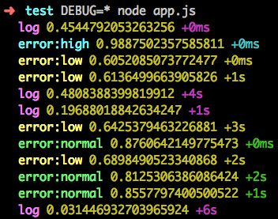
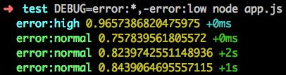

上一小节讲解了如何用使用 VS Code 调试 Node.js 代码，但调试不只是打断点，比如：

- 如何快速的切换输出的日志类型（或级别）?
- 我只想试一下用 moment 打印出年份是 `moment().format('YYYY')` 还是 `moment().format('yyyy')` 还是两种写法都可以?
- 断言报错：AssertionError: false == true，没啥有用信息，黑人问号???

本文将介绍给大家 3 款实用的调试工具，分别解决以上 3 种情况，提高我们的调试效率。

## debug

debug 是一个小巧却非常实用的日志模块，可以根据环境变量决定打印不同类型（或级别）的日志。测试代码：

**app.js**

```js
const normalLog = require('debug')('log')
const errorLowLog = require('debug')('error:low')
const errorNormalLog = require('debug')('error:normal')
const errorHighLog = require('debug')('error:high')

setInterval(() => {
  const value = Math.random()
  switch (true) {
    case value < 0.5: normalLog(value); break
    case value >= 0.5 && value < 0.7: errorLowLog(value); break
    case value >= 0.7 && value < 0.9: errorNormalLog(value); break
    case value >= 0.9: errorHighLog(value); break
    default: normalLog(value)
  }
}, 1000)
```

上面代码每一秒生成一个随机数，根据随机数的值模拟不同级别的日志输出：

- < 0.5：正常日志
- 0.5~0.7：低级别的错误日志
- 0.7~0.9：一般级别的错误日志
- \>= 0.9：严重级别的错误日志

运行：

```sh
$ DEBUG=* node app.js
```

打印如下：



可以看出，debug 模块打印的日志相比较于 console.log，有以下几个特点：

1. 不同的日志类型分配了不同的颜色加以区分，更直观
2. 添加了日志类型的前缀
3. 添加了自上一次该类型日志打印到这次日志打印经历了多长时间的后缀

debug 模块支持以下用法：

- DEBUG=*：打印所有类型的日志
- DEBUG=log：只打印 log 类型的日志
- DEBUG=error:*：打印所有以 error: 开头的日志
- DEBUG=error:*,-error:low：打印所有以 error: 开头的并且过滤掉 error:low 类型的日志

下面演示一下第 4 种的用法，运行：

```sh
$ DEBUG=error:*,-error:low node app.js
```

打印如下：



## repl2

我们在写代码的时候，有时候记不太清某个模块某个方法的具体用法，比如：moment 打印出年份是 `moment().format('YYYY')` 还是 `moment().format('yyyy')` 还是两种写法都可以？lodash 的 `_.pick` 方法能否能接收数组作为参数？这个时候相比较于翻阅官方文档，在 REPL 里试一下可能来得更快，通常步骤是：

```sh
$ npm i moment
$ node
> const moment = require('moment')
> moment().format('YYYY')
'2017'
> moment().format('yyyy')
'yyyy'
```

一次还好，这样用次数多了也略微繁琐，repl2 模块便是为了解决这个问题而生。

repl2 顾名思义是 REPL 的增强版，repl2 会根据一个用户配置（~/.noderc），预先加载模块到 REPL 中，省下了我们手动在 REPL 中 require 模块的过程。

全局安装：

```sh
$ npm i repl2 -g
```

使用方式很简单:

1. 将常用的模块全局安装，如：

```sh
$ npm i lodash validator moment -g
```

2. 添加配置到 ~/.noderc：

```json
{
  "lodash": "__",
  "moment": "moment",
  "validator": "validator"
}
```

3. 运行 noder：

```sh
$ noder
__ = lodash@4.17.4 -> local
moment = moment@2.18.1 -> global
validator = validator@7.0.0 -> global
> moment().format('YYYY')
'2017'
> __.random(0, 5)
3
> validator.isEmail('foo@bar.com')
true
```

有几点需要讲解下：

1. ~/.noderc 是一个 JSON 文件，key 是模块名字，value 是 require 这个模块后加载到 REPL 中的变量名。这里给 lodash 命名的变量名是 __ 而不是 _，是因为 REPL 中 _ 有特殊含义，表示上一个表达式的结果
2. repl2 会优先加载当前目录下的模块，没有找到然后再去加载全局安装的模块。上面结果显示 lodash 是从本地目录加载的，因为 test 目录下已经安装了 lodash，其余的模块没有从本地目录找到则尝试从全局 npm 目录加载。如果都没有找到，则不会加载

## power-assert

我们常用的断言库有：

- [should.js](https://github.com/shouldjs/should.js)
- [expect.js](https://github.com/Automattic/expect.js)
- [chai](https://github.com/chaijs/chai)

但这类断言库都有一些通病：

1. 过分追求语义化，API 复杂
2. 错误信息不足

看一段代码：

**test.js**

```js
const assert = require('assert')
const should = require('should')
const expect = require('expect.js')

const tom = { id: 1, age: 18 }
const bob = { id: 2, age: 20 }

describe('app.js', () => {
  it('assert', () => {
    assert(tom.age > bob.age)
  })
  it('should.js', () => {
    tom.age.should.be.above(bob.age)
  })
  it('expect.js', () => {
    expect(tom.age).be.above(bob.age)
  })
})
```

运行：

```sh
$ mocha
```

结果如下：

```js
app.js
  1) assert
  2) should.js
  3) expect.js


0 passing (13ms)
3 failing

1) app.js
     assert:

    AssertionError [ERR_ASSERTION]: false == true
    + expected - actual

    -false
    +true

    at Context.it (test.js:10:5)

2) app.js
     should.js:
   AssertionError: expected 18 to be above 20
    at Assertion.fail (node_modules/should/cjs/should.js:275:17)
    at Assertion.value (node_modules/should/cjs/should.js:356:19)
    at Context.it (test.js:13:23)

3) app.js
     expect.js:
   Error: expected 18 to be above 20
    at Assertion.assert (node_modules/expect.js/index.js:96:13)
    at Assertion.greaterThan.Assertion.above (node_modules/expect.js/index.js:297:10)
    at Function.above (node_modules/expect.js/index.js:499:17)
    at Context.it (test.js:16:24)
```

基本没啥有用信息。这个时候，power-assert 粉墨登场。

power-assert 使用起来很简单，理论上只用一个 assert 就可以了，而且可以无缝的迁移。

**注意**：使用 intelli-espower-loader 要求必须将测试文件放到 test/ 目录，所以我们在 test 目录下创建 test/app.js，将原来的 test.js 代码粘贴过去。

安装 power-assert 和 intelli-espower-loader，然后运行测试：

```sh
$ npm i power-assert intelli-espower-loader --save-dev
$ mocha -r intelli-espower-loader
```

结果如下：

```js
app.js
  1) assert
  2) should.js
  3) expect.js


0 passing (42ms)
3 failing

1) app.js
     assert:

    AssertionError [ERR_ASSERTION]:   # test/app.js:10

assert(tom.age > bob.age)
       |   |   | |   |
       |   |   | |   20
       |   |   | Object{id:2,age:20}
       |   18  false
       Object{id:1,age:18}

    + expected - actual

    -false
    +true
    ...
```

错误信息非常直观，有两点需要说明下：

1. mocha 需要引入 intelli-espower-loader，主要是转译代码，转译之后 `require('assert')` 都不需要改
2. intelli-espower-loader 可选地在 package.json 添加 directories.test 配置，如：

```json
"directories": {
  "test": "mytest/"
}
```

如果没有 directories.test 配置则默认是 `test/`。

## 参考链接

- https://zhuanlan.zhihu.com/p/25956323
- https://www.npmjs.com/package/intelli-espower-loader

上一节：[4.3 Visual Studio Code](https://github.com/nswbmw/node-in-debugging/blob/master/4.3%20Visual%20Studio%20Code.md)

下一节：[4.5 supervisor-hot-reload](https://github.com/nswbmw/node-in-debugging/blob/master/4.5%20supervisor-hot-reload.md)
