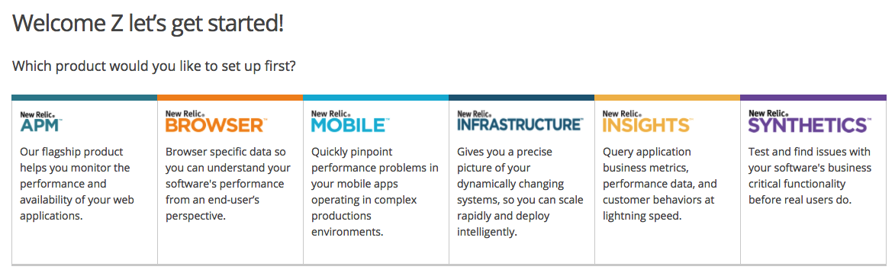
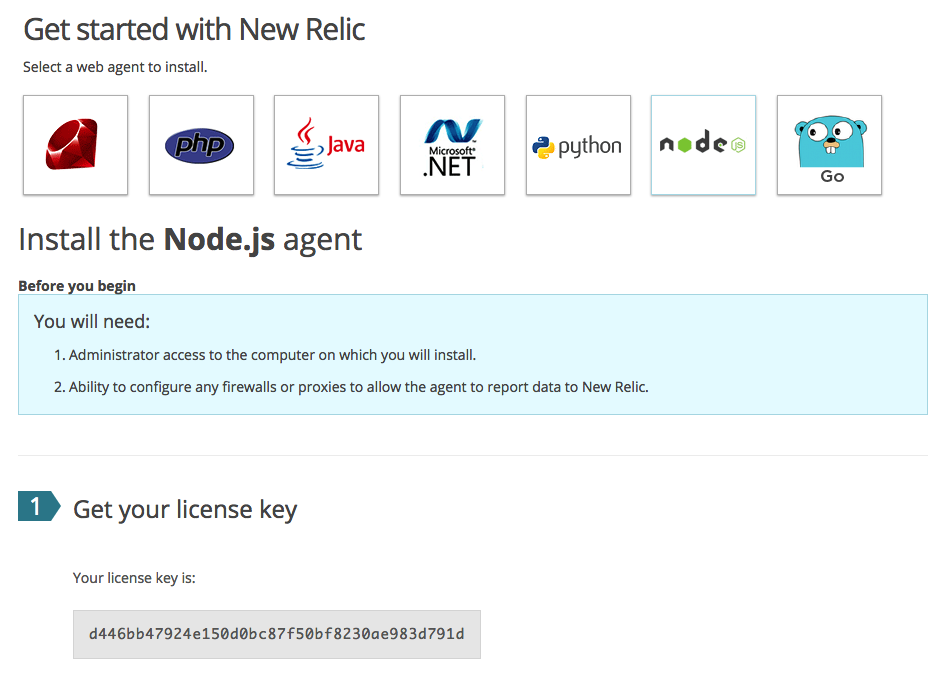
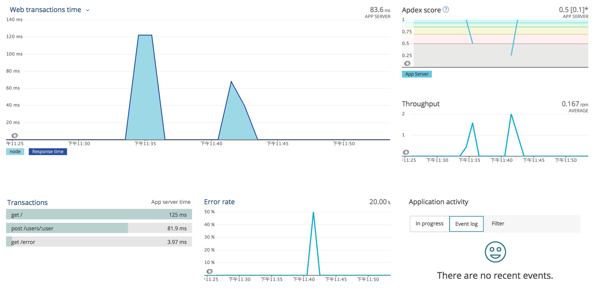

[NewRelic](https://newrelic.com/) 是一个老牌的应用性能监测工具，提供 14 天免费试用，本文将讲解如何使用 NewRelic 监控 Node.js 程序的性能。

测试代码：

**app.js**

```js
require('newrelic')

const crypto = require('crypto')
const express = require('express')
const app = express()
const createUser = require('./routes/users').createUser

app.get('/', (req, res) => {
  const salt = crypto.randomBytes(128).toString('base64')
  const hash = crypto.pbkdf2Sync(String(Math.random()), salt, 10000, 512, 'sha512').toString('hex')
  res.json({ salt, hash })
})

app.get('/error', (req, res, next) => {
  next(new Error('error!!!'))
})

app.post('/users/:user', async (req, res) => {
  const user = await createUser(req.params.user, 18)
  res.json(user)
})

app.listen(3000)
```

**routes/users.js**

```js
const Mongolass = require('mongolass')
const mongolass = new Mongolass('mongodb://localhost:27017/test')
const User = mongolass.model('User')

exports.createUser = async function (ctx) {
  const name = ctx.query.name || 'default'
  const age = +ctx.query.age || 18
  const user = await createUser(name, age)
  ctx.status = user
}

async function createUser (name, age) {
  const user = (await User.create({
    name,
    age
  })).ops[0]
  return user
}
```

## 使用 NewRelic

首先，注册一个 [NewRelic](https://newrelic.com/signup) 账号。创建一个应用，如下所示：



选择 APM，进入下一步，选择 Node.js 应用，并拿到 license key：



在 Node.js 中使用 NewRelic 步骤如下：

```sh
$ npm i newrelic --save # 安装 NewRelic 的 Node.js SDK
$ cp node_modules/newrelic/newrelic.js . # 将默认配置文件拷贝到项目根目录下
```

修改 newrelic.js，app_name 填写你的应用名（如：api），license_key 填写刚才生成的 license key。

启动测试程序，并发起几个请求，稍等几分钟，NewRelic 的后台将会收到并展示一些数据（如：吞吐量，请求的 Urls，错误率、Apdex score 等等）：



试用版功能有限，升级到付费版可解锁更多功能，如：数据库分析、错误分析甚至 Node.js VM 监控（如：CPU、内存、GC、Event Loop）等等。

类似的其他 APM 有：

- [AppDynamics](https://www.appdynamics.com/)
- [OneAPM](oneapm.com)
- [DataDog](https://www.datadoghq.com/monitor-nodejs/)
- [atatus](https://www.atatus.com/)
- [opbeat](https://opbeat.com/nodejs )

用法大同小异，这里就不一一介绍了。

上一节：[4.5 supervisor-hot-reload](https://github.com/nswbmw/node-in-debugging/blob/master/4.5%20supervisor-hot-reload.md)

下一节：[5.2 Elastic APM](https://github.com/nswbmw/node-in-debugging/blob/master/5.2%20Elastic%20APM.md)
