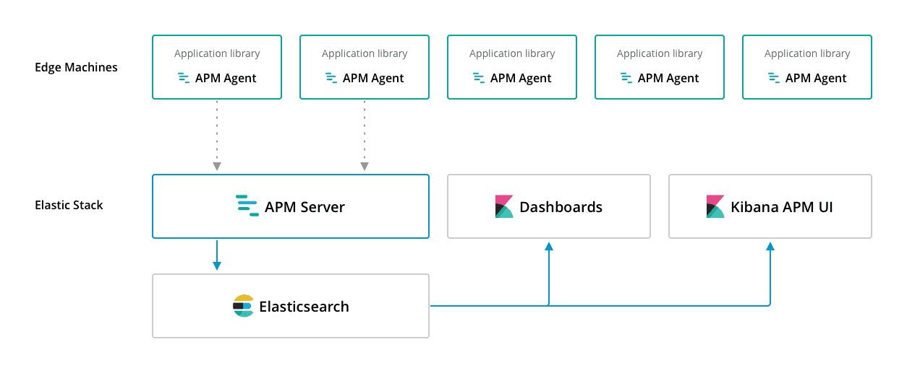
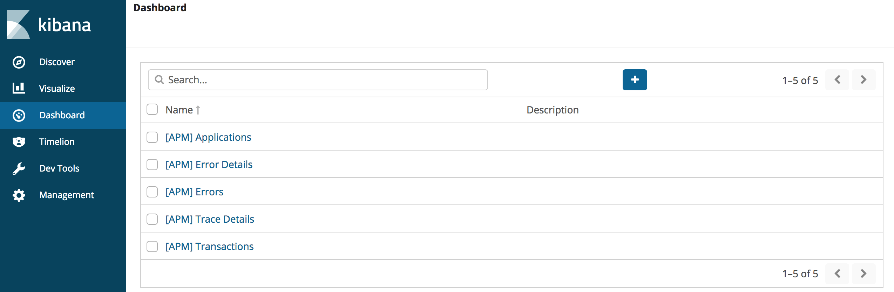
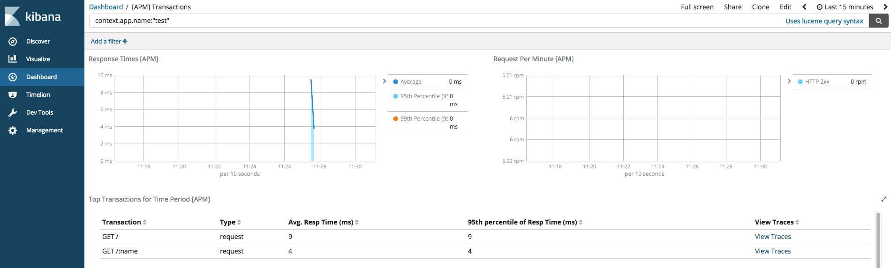
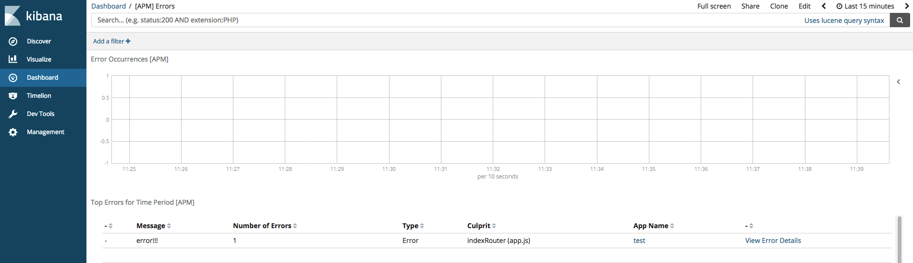
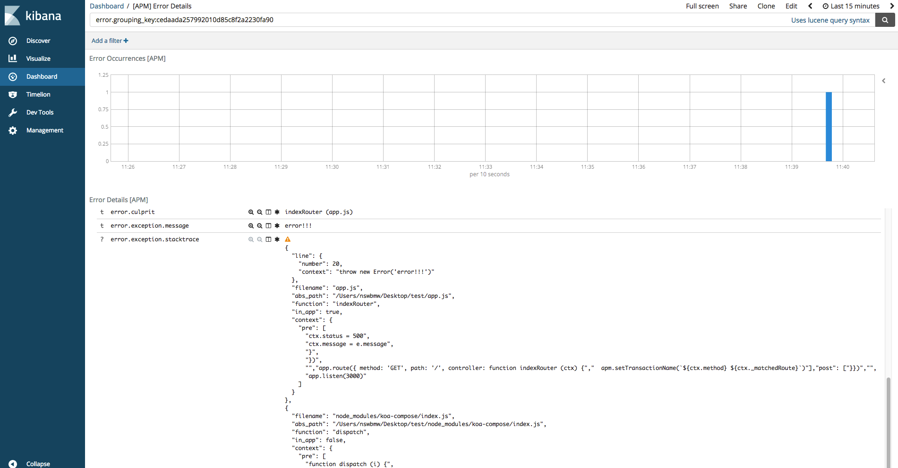

Elastic APM 是 Elastic 公司开源的一款 APM 工具，目前还处于 Beta 阶段，它有以下几个优势：

1. 开源。你可以免费使用，像使用 ELK 一样。
2. 功能完善。API 比较完善，有 Agent、Transaction、Trace，默认创建响应时间和每分钟请求数两种图表，且可以使用 Kibana 的 Filter 过滤生成关心的数据的图表。
3. 监控与日志统一。Elastic APM 依赖 ElasticSearch + Kibana，所以可以结合 ELK 使用，可在 Kibana 查看监控然后直接查询日志。

Elastic APM 架构如下：



APM Agent（即在应用端引入的探针）将收集的日志发送到 APM Server（Go 写的 HTTP 服务），APM Server 将数据存储到 ElasticSearch，然后通过 Kibana 展示。

Kibana 展示如下：


## 安装并启动 ELK

我们使用 docker 安装并启动 ELK，运行如下命令：

```sh
$ docker run -p 5601:5601 \
    -p 9200:9200 \
    -p 5044:5044 \
    -it --name elk sebp/elk
```

## 安装并启动 APM Server

首先，下载 [APM Server](https://www.elastic.co/downloads/apm/apm-server) 解压。然后运行以下命令：

```sh
$ ./apm-server setup # 导入 APM 仪表盘到 Kibana
$ ./apm-server -e # 启动 APM Server，默认监听 8200 端口
```

浏览器打开 localhost:5601，进入 Dashboard 页，如下所示：



## 测试代码

```js
const apm = require('elastic-apm-node').start({
  appName: 'test'
})

const Paloma = require('paloma')
const app = new Paloma()

app.route({ method: 'GET', path: '/', controller (ctx) {
  apm.setTransactionName(`${ctx.method} ${ctx._matchedRoute}`)
  ctx.status = 200
}})

app.route({ method: 'GET', path: '/:name', controller (ctx) {
  apm.setTransactionName(`${ctx.method} ${ctx._matchedRoute}`)
  ctx.status = 200
}})

app.listen(3000)
```

运行该程序，发起两个请求：

```sh
$ curl localhost:3000/
$ curl localhost:3000/nswbmw
```

等待一会，Kibana 展示如下：



在 Elastic APM 中，有两个术语：

- transaction：一组 traces 的集合，如：一个 HTTP 请求
- trace：一个事件及持续时间，如：一个 SQL 查询

## 错误日志

我们来测试下 Elastic APM 的错误收集功能。修改测试代码为：

```js
const apm = require('elastic-apm-node').start({
  appName: 'test'
})

const Paloma = require('paloma')
const app = new Paloma()

app.use(async (ctx, next) => {
  try {
    await next()
  } catch (e) {
    apm.captureError(e)
    ctx.status = 500
    ctx.message = e.message
  }
})

app.route({ method: 'GET', path: '/', controller: function indexRouter (ctx) {
  apm.setTransactionName(`${ctx.method} ${ctx._matchedRoute}`)
  throw new Error('error!!!')
}})

app.listen(3000)
```

重启测试程序，并发起一次请求。回到 Kibana，点击 Dashboard -> [APM] Errors 可以看到错误日志记录（自动聚合）和图表，如下所示：



点击 View Error Details 进入错误详情页，如下所示：



**可以看出**：错误日志中展示了错误代码及行数，上下几行代码，父级函数名和所在文件等信息。

## 参考链接

- https://www.elastic.co/guide/en/apm/agent/nodejs/0.x/index.html
- https://www.elastic.co/guide/en/apm/agent/nodejs/0.x/custom-stack.html

上一节：[5.1 NewRelic](https://github.com/nswbmw/node-in-debugging/blob/master/5.1%20NewRelic.md)

下一节：[6.1 koa-await-breakpoint](https://github.com/nswbmw/node-in-debugging/blob/master/6.1%20koa-await-breakpoint.md)
