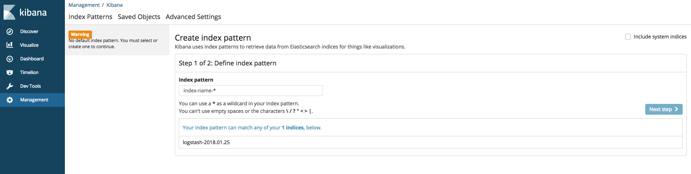
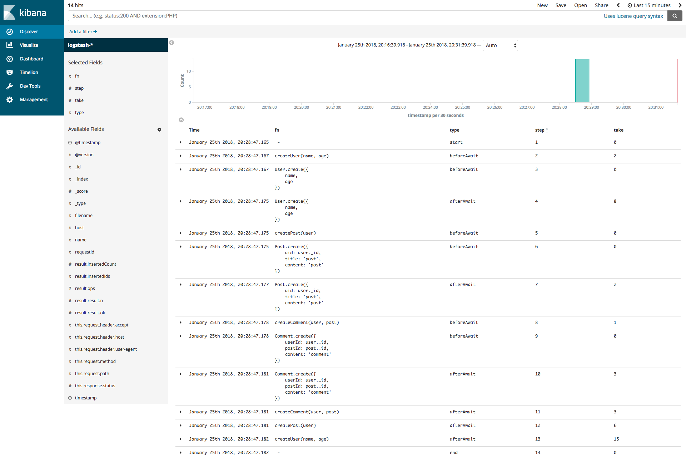
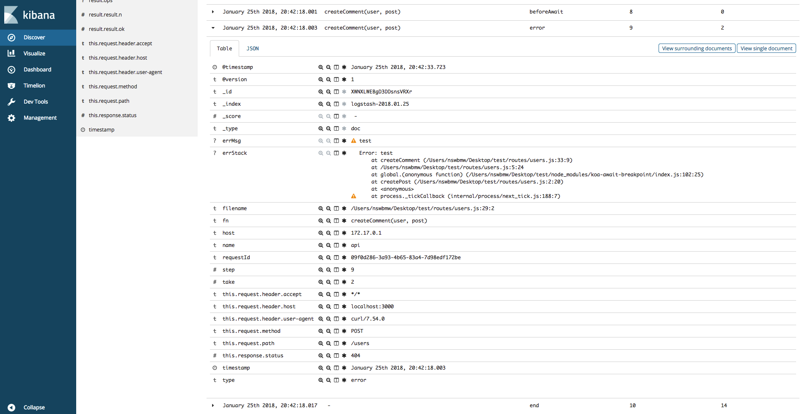

ELK 是 ElasticSearch + Logstash + Kibana 这套组合工具的简称，是一个常用的日志系统。

- ElasticSearch：是一个开源的基于 Lucene 之上实现的一个分布式搜索引擎，也是一个存储引擎（如：日志），它的特点有：分布式，零配置，自动发现，索引自动分片，索引副本机制，restful 风格接口，多数据源，自动搜索负载等。
- Logstash：开源的日志收集工具，它可以对日志进行收集、分析、过滤，并将其存储（如：ElasticSearch）供以后使用。
- Kibana：开源和免费的可视化工具，可以为 ElasticSearch 提供的日志分析友好的 Web 界面，可以汇总、分析和搜索重要数据日志。

## 安装 ELK

我们使用 docker 安装 ELK，运行如下命令：

```sh
$ docker run -p 5601:5601 \
    -p 9200:9200 \
    -p 5044:5044 \
    -p 15044:15044/udp \
    -it --name elk sebp/elk
```

进入容器：

```sh
$ docker exec -it elk /bin/bash
```

运行以下命令设置 logstash 的 input 和 output：

```sh
# /opt/logstash/bin/logstash --path.data /tmp/logstash/data \
  -e 'input { udp { codec => "json" port => 15044 } } output { elasticsearch { hosts => ["localhost"] } }'
```

这里我们启动一个 15044 udp 端口，用来接收通过 UDP 发送到 Logstash 的日志。

浏览器打开 localhost:5601，如下所示：


目前还没有指定 index（ElasticSearch 的 index 类似 MySQL/MongoDB 中的 database），即日志来源。下面我们尝试往 ELK 写入一些日志。

## 使用 ELK

我们仍然使用 koa-await-breakpoint 为例，来演示如何将日志发送到 ELK。

**app.js**

```js
const koaAwaitBreakpoint = require('koa-await-breakpoint')({
  name: 'api',
  files: ['./routes/*.js'],
  store: require('./logger')
})

const Paloma = require('paloma')
const app = new Paloma()

app.use(koaAwaitBreakpoint)
app.route({ method: 'POST', path: '/users', controller: require('./routes/user').createUser })

app.listen(3000)
```

**logger.js**

```js
const Logstash = require('logstash-client')

const logstash = new Logstash({
  type: 'udp',
  host: 'localhost',
  port: 15044
})

module.exports = {
  save (log) {
    if (log.error) {
      log.errMsg = log.error.message
      log.errStack = log.error.stack
    }
    logstash.send(log)
  }
}
```

**routes/user.js**

```js
const Mongolass = require('mongolass')
const mongolass = new Mongolass('mongodb://localhost:27017/test')
const User = mongolass.model('User')
const Post = mongolass.model('Post')
const Comment = mongolass.model('Comment')

exports.createUser = async function (ctx) {
  const name = ctx.query.name || 'default'
  const age = +ctx.query.age || 18
  await createUser(name, age)
  ctx.status = 204
}

async function createUser (name, age) {
  const user = (await User.create({
    name,
    age
  })).ops[0]
  await createPost(user)
}

async function createPost (user) {
  const post = (await Post.create({
    uid: user._id,
    title: 'post',
    content: 'post'
  })).ops[0]

  await createComment(user, post)
}

async function createComment (user, post) {
  await Comment.create({
    userId: user._id,
    postId: post._id,
    content: 'comment'
  })
}
```

运行：

```sh
$ curl -XPOST localhost:3000/users
```

此时，刷新 Kibana 如下所示：



初次使用需要配置 Kibana 从 ElasticSearch 的哪些 index 搜索日志，我们在 `Index pattern` 处填 `logstash-*`，然后点击 Next step。下一步的 `Time Filter field name` 选择 timestamp 点击 Create index pattern 完成配置。

**注意**：我们选择 timestamp 而不是默认的 @timestamp，因为 koa-await-breakpoint 的日志中有 timestamp 字段。

点击左侧目录 Discover，我们发现已经有日志了。分别点击左侧出现的 Available Fields 的 fn、type、step、take，然后按 step 升序展示，如下所示：



是不是一目了然！每个请求每一步的函数及其执行时间都记录下来了。

修改 routes/users.js 的 createComment，throw 一个 `new Error('test')`。重启程序并发起一个请求，ELK 显示如下：



**Tips**: 实际应用中会有非常多的日志，我们可以通过 requestId 找到一个请求的所有日志，第 7.2 小节会讲解。

ELK 非常强大，基本能满足所有日志查询需求，查询语法使用 lucene 语法，花个 10 分钟就能大体上手。Kibana 还能创建各种仪表盘和聚合图表，还请读者自己动手尝试。

## 参考文献

- http://blog.51cto.com/baidu/1676798
- http://elk-docker.readthedocs.io

上一节：[6.2 async_hooks](https://github.com/nswbmw/node-in-debugging/blob/master/6.2%20async_hooks.md)

下一节：[6.4 OpenTracing + Jaeger](https://github.com/nswbmw/node-in-debugging/blob/master/6.4%20OpenTracing%20%2B%20Jaeger.md)
