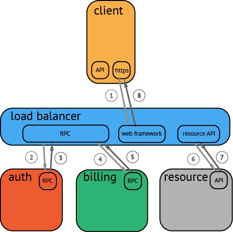
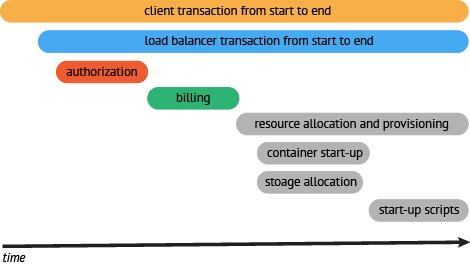
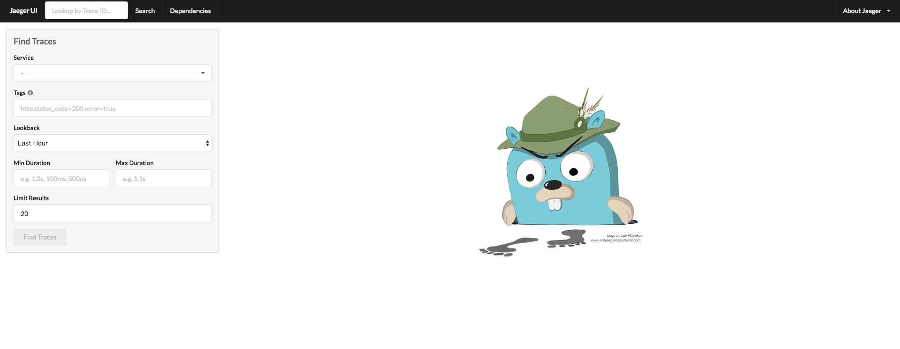
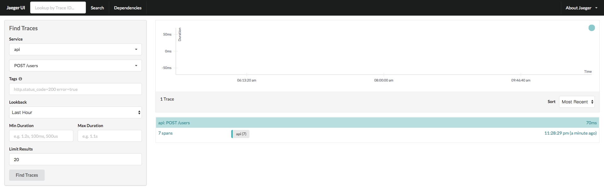
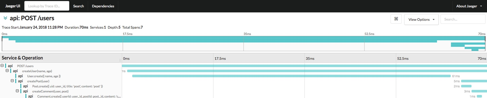
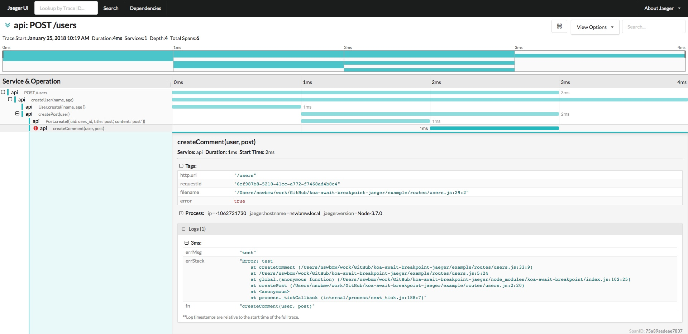

## 什么是 OpenTracing ？

OpenTracing（[opentracing.io](http://opentracing.io/)）是一个分布式追踪规范。OpenTracing 通过提供平台无关、厂商无关的 API，为分布式追踪提供统一的概念和数据标准，使得开发人员能够方便的添加（或更换）追踪系统的实现。OpenTracing 定义了几个术语：

- Span：代表了系统中的一个逻辑工作单元，它具有操作名、操作开始时间以及持续时长。Span 可能会有嵌套或排序，从而对因果关系建模。
  - Tags：每个 Span 可以有多个键值对（key: value）形式的 Tags，Tags 是没有时间戳的，支持简单的对 Span 进行注解和补充。
  - Logs：每个 Span 可以进行多次 Log 操作，每一次 Log 操作，都需要一个带时间戳的时间名称，以及可选的任意大小的存储结构。
- Trace：代表了系统中的一个数据/执行路径（一个或多个 Span），可以理解成 Span 的有向无环图。

OpenTracing 还有其他一些概念，这里不过多解释。我们看个传统的调用关系例子：



> 在一个分布式系统中，追踪一个事务或者调用流一般如上图所示。虽然这种图对于看清各组件的组合关系是很有用的，但是，它不能很好显示组件的调用时间，是串行调用还是并行调用，如果展现更复杂的调用关系，会更加复杂，甚至无法画出这样的图。另外，这种图也无法显示调用间的时间间隔以及是否通过定时调用来启动调用。一种更有效的展现一个典型的 trace 过程，如下图所示：



> 这种展现方式增加显示了执行时间的上下文，相关服务间的层次关系，进程或者任务的串行或并行调用关系。这样的视图有助于发现系统调用的关键路径。通过关注关键路径的执行过程，项目团队可能专注于优化路径中的关键位置，最大幅度的提升系统性能。例如：可以通过追踪一个资源定位的调用情况，明确底层的调用情况，发现哪些操作有阻塞的情况。

## 什么是 Jaeger ?

Jaeger 是 OpenTracing 的一个实现，是 Uber 开源的一个分布式追踪系统，其灵感来源于Dapper 和 OpenZipkin。从 2016 年开始，该系统已经在 Uber 内部得到了广泛的应用，它可以用于微服务架构应用的监控，特性包括分布式上下文传播（Distributed context propagation）、分布式事务监控、根原因分析、服务依赖分析以及性能/延迟优化。该项目已经被云原生计算基金会（Cloud Native Computing Foundation，CNCF）接纳为第 12 个项目。

## 启动 Jaeger + Jaeger UI

我们使用 Docker 启动 Jaeger + Jaeger UI（Jaeger 可视化 web 控制台），运行如下命令：

```sh
$ docker run -d -p5775:5775/udp \
  -p 6831:6831/udp \
  -p 6832:6832/udp \
  -p 5778:5778 \
  -p 16686:16686 \
  -p 14268:14268 \
  jaegertracing/all-in-one:latest
```

浏览器打开 localhost:16686，如下所示：



现在并没有任何数据，接下来我们看看如何使用 Jaeger 接收并查询日志。

## 如何使用 OpenTracing + Jaeger ?

OpenTracing 和 Jaeger 分别提供了 JavaScript/Node.js 的 SDK：

- [opentracing/opentracing-javascript](https://github.com/opentracing/opentracing-javascript)
- [jaegertracing/jaeger-client-node](https://github.com/jaegertracing/jaeger-client-node)

opentracing 示例代码如下：

```js
const http = require('http')
const opentracing = require('opentracing')

// NOTE: the default OpenTracing tracer does not record any tracing information.
// Replace this line with the tracer implementation of your choice.
const tracer = new opentracing.Tracer()

const span = tracer.startSpan('http_request')
const opts = {
  host : 'example.com',
  method: 'GET',
  port : '80',
  path: '/',
}
http.request(opts, res => {
  res.setEncoding('utf8')
  res.on('error', err => {
    // assuming no retries, mark the span as failed
    span.setTag(opentracing.Tags.ERROR, true)
    span.log({'event': 'error', 'error.object': err, 'message': err.message, 'stack': err.stack})
    span.finish()
  })
  res.on('data', chunk => {
    span.log({'event': 'data_received', 'chunk_length': chunk.length})
  })
  res.on('end', () => {
    span.log({'event': 'request_end'})
    span.finish()
  })
}).end()
```

有 2 点需要解释下：

1. 需要将上面的 `const tracer = new opentracing.Tracer()` 替换成自己的 tracer 实现，即 jaeger 的实现。
2. 通过 tracer.startSpan 启动一个 Span，span.setTag 设置 Tags，span.log 设置 Logs，span.finish 结束一个 Span。

有点类似于我们的手动埋点，只不过变成了一个规范而已。但 OpenTracing 不止如此，上面只是一个 Span 的用法，Span 之间还可以关联调用关系，最后得到一个 DAG（有向无环图）。

**举个例子**：假如你正在搞微服务，多个服务之间有调用关系（不管是 HTTP 还是 RPC 等），每次调用服务内部可能产生多个 Span，最终会在 Jaeger 控制台页面看到一个完整的 Trace 和 DAG 图（微服务之间的调用关系）。

jaeger-client-node 使用如下：

```js
const tracer = new jaeger.Tracer(
  serviceName,
  new jaeger.RemoteReporter(new UDPSender()),
  new jaeger.RateLimitingSampler(1)
)
```

创建一个 tracer 接收 3 个参数：

1. serviceName：服务名
2. Reporter：上报器，即往哪发日志，如上例是通过 UDP 发送日志，默认地址 localhost:6832
3. Sampler：采样器，即日志如何采样，如上例是限制 1 秒采样一次

更多选项这里不再详细介绍，读者可自行去查阅 jaeger-client-node 的文档。

## koa-await-breakpoint-jaeger

通过上面例子我们知道，使用 Jaeger 需要手动埋点，前面我们介绍了 koa-await-breakpoint 日志自动打点，可自定义 store，koa-await-breakpoint-jaeger 是为 koa-await-breakpoint 写的 store 的 adaptor，实现上有一些小技巧，这里也不过多讲解，有兴趣的可以去看下源码。

还是拿 koa-await-breakpoint 的 example 举例，只添加了 2 行代码引入 jaeger 的使用。代码如下：

**app.js**

```js
const JaegerStore = require('koa-await-breakpoint-jaeger')
const koaAwaitBreakpoint = require('koa-await-breakpoint')({
  name: 'api',
  files: ['./routes/*.js'],
  store: new JaegerStore()
})

const Paloma = require('paloma')
const app = new Paloma()

app.use(koaAwaitBreakpoint)
app.route({ method: 'POST', path: '/users', controller: require('./routes/user').createUser })

app.listen(3000)
```

运行：

```sh
$ curl -XPOST localhost:3000/users
```

刷新 localhost:16686 可以看到已经有日志了，如下所示：



选择 Sercice -> api，Operation -> POST /users，点击 Find Traces 查看所有结果，右侧展示了一条日志，点进去如下所示：



**Tips**：可以根据 tags 过滤结果。

**注意**：Jaeger 是分布式追踪系统，通常用来追踪多个服务之间的调用关系，而这里用来追踪一个服务多个函数之间的调用关系。

修改 routes/user.js 的 createComment 函数 throw 一个 `new Error('test')`，重新运行，如下所示：



完美的展现了一个请求到来时，函数之间的调用关系和层级关系以及耗时，甚至函数体和错误栈都有！然后，我们可以拿 requestId 去 ELK 查询日志。

## 参考文献

- https://wu-sheng.gitbooks.io/opentracing-io/content/
- https://segmentfault.com/a/1190000008895129
- http://www.infoq.com/cn/news/2017/11/Uber-open-spurce-Jaeger

上一节：[6.3 ELK](https://github.com/nswbmw/node-in-debugging/blob/master/6.3%20ELK.md)

下一节：[6.5 Sentry](https://github.com/nswbmw/node-in-debugging/blob/master/6.5%20Sentry.md)
