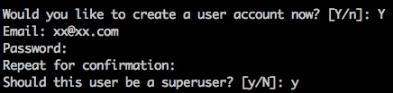
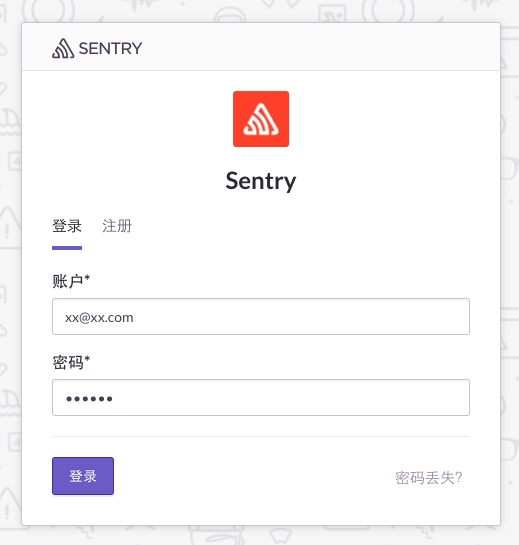
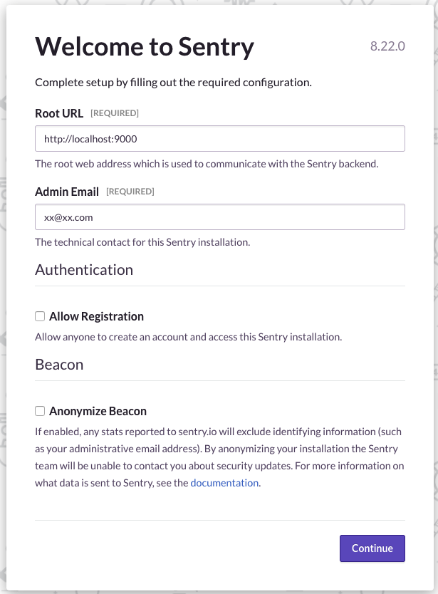
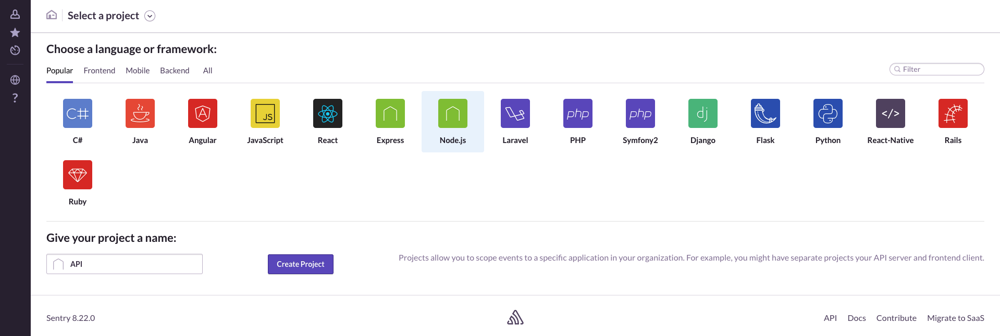
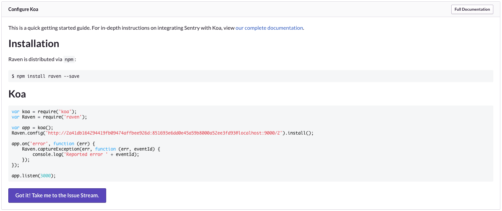
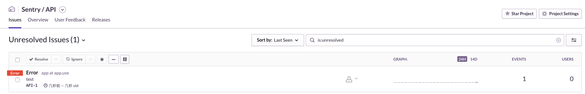
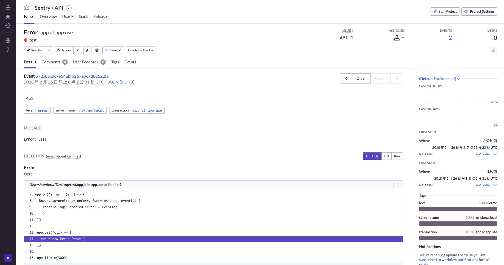

## Sentry 是什么？

Sentry[官网](sentry.io)介绍：

> Sentry’s real-time error tracking gives you insight into production deployments and information to reproduce and fix crashes.

**简言之**：Sentry 是一个开源的实时错误日志收集平台。

## 安装 Sentry

我们使用 Docker 安装并启动 Sentry，步骤如下:

1. 启动一个 Redis 容器，命名为 sentry-redis：

   ```sh
   $ docker run -d --name sentry-redis redis
   ```

2. 启动一个 Postgres 容器，命名为 sentry-postgres：

   ```sh
   $ docker run -d \
     --name sentry-postgres \
     -e POSTGRES_PASSWORD=secret \
     -e POSTGRES_USER=sentry \
     postgres
   ```

3. 生成一个 Sentry 的 secret key：

   ```sh
   $ docker run --rm sentry config generate-secret-key
   ```

   将下面的 \<secret-key\> 都替换成上面生成的 secret key。

4. 如果是新的数据库（第一次运行），需要运行 upgrade：

   ```sh
   $ docker run -it --rm \
     -e SENTRY_SECRET_KEY='<secret-key>' \
     --link sentry-postgres:postgres \
     --link sentry-redis:redis \
     sentry upgrade
   ```

   如下，按步骤填写自己的信息：

   

   最终创建了一个超级管理员和一个默认的名为 sentry 的组织（organization）。

5. 启动 Sentry，并对外暴露 9000 端口：

   ```sh
   $ docker run -d \
     --name my-sentry \
     -e SENTRY_SECRET_KEY='<secret-key>' \
     --link sentry-redis:redis \
     --link sentry-postgres:postgres \
     -p 9000:9000 \
     sentry
   ```

6. 启动 Celery cron 和 Celery workers：

   ```sh
   $ docker run -d \
     --name sentry-cron \
     -e SENTRY_SECRET_KEY='<secret-key>' \
     --link sentry-postgres:postgres \
     --link sentry-redis:redis \
     sentry run cron
   ```

   ```sh
   $ docker run -d \
     --name sentry-worker-1 \
     -e SENTRY_SECRET_KEY='<secret-key>' \
     --link sentry-postgres:postgres \
     --link sentry-redis:redis \
     sentry run worker
   ```

   **Tips**：Celery 是 Python 写的一个分布式任务调度模块。

7. 完成！

浏览器打开 localhost:9000 就能看到 Sentry 的登录页面了。

   

首次登录需要填写一些必要信息 ，如下所示：

点击 Continue 进入 Sentry 仪表盘（Dashboard）。点击右上角 New Project 创建一个项目，选择 Node.js 并填写项目名称为 API，然后 Create Project 创建项目。如下所示：   

创建成功后进入 Node.js 使用示例页面，我们选择使用 Koa 测试，右侧选择 Koa：

  

上图是 koa@1 的示例代码，我们以 Paloma（基于  koa@2）为例，编写测试代码：

```js
const Raven = require('raven')
const Paloma = require('paloma')
const app = new Paloma()

Raven.config(DSN).install()

app.on('error', (err) => {
  Raven.captureException(err, (err, eventId) => {
    console.log('Reported error ' + eventId)
  })
})

app.use((ctx) => {
  throw new Error('test')
})

app.listen(3000)
```

**Tips**：DSN 替换为第 10 步截图中的 `http://xxx@localhost:9000/2`，DSN 既告诉客户端 Sentry 服务器地址，也用来当做身份认证的 token。

运行以上测试代码，访问 localhost:3000，错误信息会发送给 Sentry。Sentry 展示如下：



点进去可以看到详细的信息：



Sentry 还有许多功能比如：错误的归类、展示错误的频率柱状图、将错误指派给组织中的某个人、给错误添加标签、查看这类错误事件的历史、标记错误为已解决、在错误下发表评论、警报等等功能，更多配置见 Project Settings。

## koa-raven

笔者将 Raven 封装成 Koa 的一个中间件。使用如下：

```js
const raven = require('koa-raven')
const Paloma = require('paloma')
const app = new Paloma()

app.use(raven(DSN))

app.use((ctx) => {
  throw new Error('test')
})

app.listen(3000)
```

或者使用 ctx.raven：

```js
const raven = require('koa-raven')
const Paloma = require('paloma')
const app = new Paloma()

app.use(raven(DSN))

app.use((ctx) => {
  try {
    throw new Error('test')
  } catch (e) {
    ctx.raven.captureException(e, { extra: { name: 'tom' } })
    ctx.status = 500
    ctx.body = e.stack
  }
})

app.listen(3000)
```

上一节：[6.4 OpenTracing + Jaeger](https://github.com/nswbmw/node-in-debugging/blob/master/6.4%20OpenTracing%20%2B%20Jaeger.md)

下一节：[7.1 Telegraf + InfluxDB + Grafana(上)](https://github.com/nswbmw/node-in-debugging/blob/master/7.1%20Telegraf%20%2B%20InfluxDB%20%2B%20Grafana(%E4%B8%8A).md)
