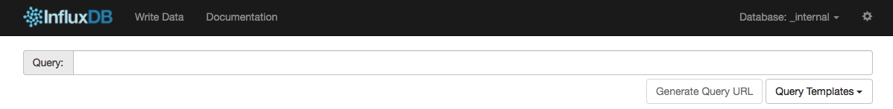
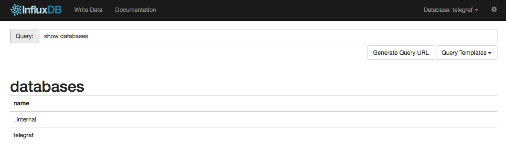
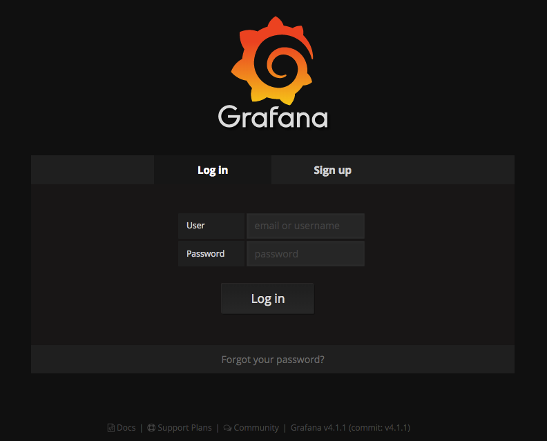
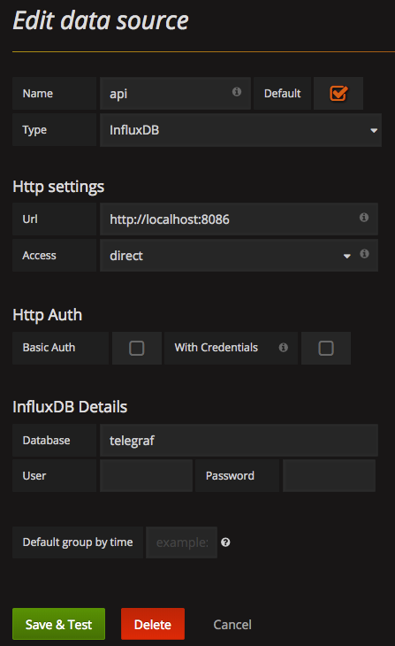
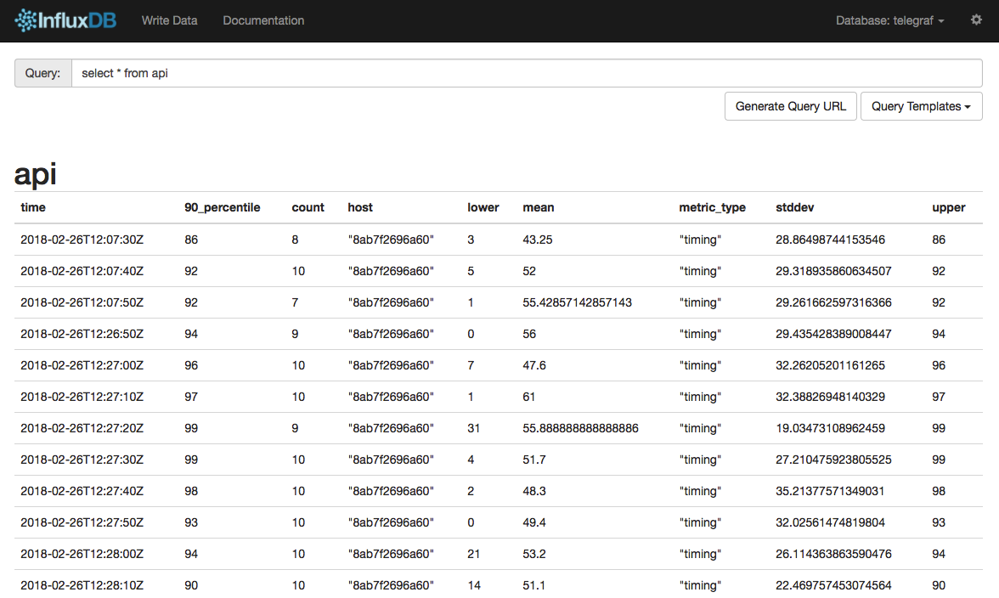
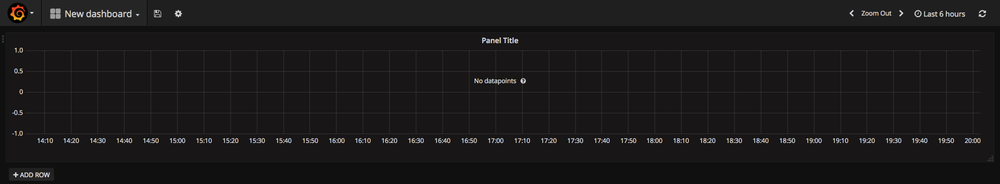
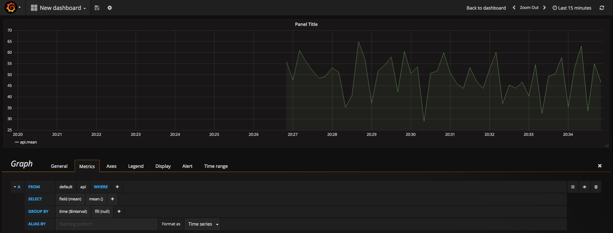
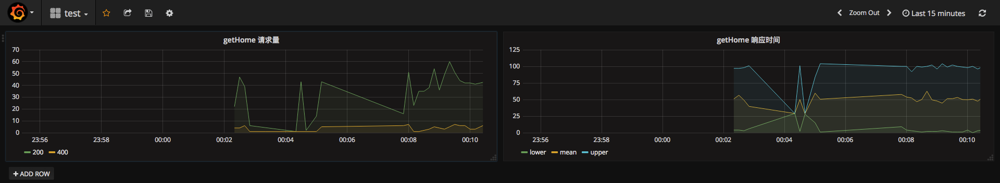
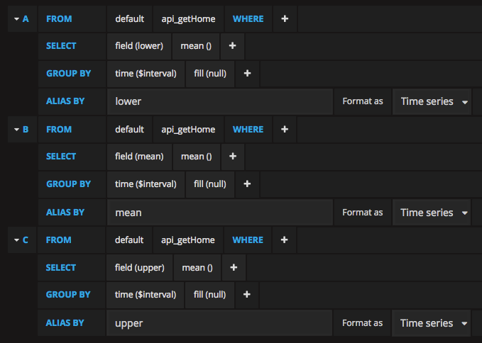

本文将会讲解如何使用 Telegraf(StatsD) + InfluxDB + Grafana 搭建一套完整的监控系统。

## 简介

[Telegraf](https://github.com/influxdata/telegraf) 是一个使用 Go 语言开发的代理程序，可收集系统和服务或者其他来源（inputs）的数据，并写入到 InfluxDB（outputs）数据库，支持多种 inputs 和 outputs 插件。[StatsD](https://github.com/etsy/statsd) 是一个使用 Node.js 开发的网络守护进程，通过 UDP 或者 TCP 方式收集各种统计信息，包括计数器和定时器等。

[InfluxDB](https://github.com/influxdata/influxdb) 是一个使用 Go 语言开发的开源的分布式时序、事件和指标数据库，无需外部依赖，其设计目标是实现分布式和水平伸缩扩展。

[Grafana](https://github.com/grafana/grafana) 是一个使用 Go 语言开发的开源的、功能齐全的、漂亮的仪表盘和图表的编辑器，可用来做日志的分析与展示曲线图（如 api 的请求日志），支持多种 backend，如 ElasticSearch、InfluxDB、OpenTSDB 等等。

**工作流程**：Telegraf 将 StatsD(inputs) 和 InfluxDB(outputs) 结合起来，即发往 StatsD 的数据，最终通过 Telegraf 写入了 InfluxDB，然后 Grafana 读取 InfluxDB 的数据展示成图表。

## 启动 docker-statsd-influxdb-grafana

我们使用 Docker 一键启动 Telegraf(StatsD) + InfluxDB + Grafana，节省搭建环境的时间。

```sh
$ docker run -d \
  --name docker-statsd-influxdb-grafana \
  -p 3003:3003 \
  -p 3004:8083 \
  -p 8086:8086 \
  -p 22022:22 \
  -p 8125:8125/udp \
  samuelebistoletti/docker-statsd-influxdb-grafana:latest
```

端口映射关系：

```
Host        Container       Service
-----------------------------------
3003        3003            grafana
3004        8083            influxdb-admin
8086        8086            influxdb
8125        8125            statsd
22022       22              sshd
```

## 熟悉 InfluxDB

容器启动后，浏览器访问 localhost:3004（以下称为 influxdb-admin），如下所示：



InfluxDB 基本概念：

- database：数据库
- measurement：数据库中的表
- point：表里面的一行数据，由时间戳（time）、数据（field）和标签（tag）组成
  - time：每条数据记录的时间戳，是数据库中的主索引（会自动生成）
  - field：各种记录的值（没有索引的属性）
  - tag：各种有索引的属性
- ...

InfluxDB 采用了类 SQL 的查询语法，如：

- show databases：列出所有数据库
- show measurements：列出当前数据库的所有表
- select * from xxx：列出 xxx 表的所有数据
- ...

我们在 Query 中输入：

```sql
show databases
```

查询结果如下：



_interal 是 InfluxDB 内部使用的数据库，telegraf 是我们当前 docker 容器启动后默认创建的测试数据库。

## 配置 Grafana

浏览器打开 localhost:3003，如下所示：



输入用户名 root 和密码 root 登录，进入初始化配置页，点击『Add data source』，如下填写：



点击『Save & Test』保存配置。目前配置好了 Grafana 默认的 datasource 是名为 api 的 InfluxDB，接下来我们创建测试代码，产生测试数据。

## node-statsd

[node-statsd](https://github.com/sivy/node-statsd) 是一个 statsd 的 Node.js client。创建以下测试代码：

```js
const StatsD = require('node-statsd')
const statsdClient = new StatsD({
  host: 'localhost',
  port: 8125
})

setInterval(() => {
  const responseTime = Math.floor(Math.random() * 100)
  statsdClient.timing('api', responseTime, function (error, bytes) {
    if (error) {
      console.error(error)
    } else {
      console.log(`Successfully sent ${bytes} bytes, responseTime ${responseTime}ms`)
    }
  })
}, 1000)
```

运行以上代码，每一秒钟产生一个 0-99 之间的随机值（模拟响应时间，单位毫秒），发送到 StatsD，StatsD 会通过 Telegraf 将这些数据写入 InfluxDB 的 telegraf 数据库。

回到 influxdb-admin，点击右上角切换到 telegraf 数据库，然后输入 `show measurements ` 查看已经存在 api 表了，然后输入：

```sql
select * from api
```

查询结果如下：



可以看出 api 表有以下几个字段：

- time：InfluxDB 默认添加的时间戳
- 90_percentile：所有记录中从小到大 90% 那个点的值
- count：一次收集的日志数量，可以看出每条记录（point）的 count 值接近或等于 10，而我们的测试代码是 1s 发送一条数据，也就说明 Telegraf 默认设置是 10s 收集一次数据，默认配置的确是这样的，见：https://github.com/samuelebistoletti/docker-statsd-influxdb-grafana/blob/master/telegraf/telegraf.conf
- host：机器地址
- lower：最小的那条记录的值
- mean：所有记录的平均值
- metric_type：metric 类型
- stddev：所有记录的标准差
- upper：最大的那条记录的值

## 创建 Grafana 图表

回到 Grafana，点击左上角 Grafana 图标的下拉菜单，点击 Dashboards 回到仪表盘页继续完成配置，点击『New dashboard』，然后点击创建 Graph 类型的图表，创建了一个空的图表，如下所示：



点击当前图表，选择 Edit，修改几个地方：

1. Metrics 配置中选择 FROM -> api 表，SELECT -> field(mean) 字段
2. Display 配置中 Null value 选择 connected 将每个点连成折线

如下所示：



## 模拟真实环境

**middlewares/statsd.js**

```js
const StatsD = require('node-statsd')
const statsdClient = new StatsD({
  host: 'localhost',
  port: 8125
})

module.exports = function (routerName) {
  return async function statsdMiddleware (ctx, next) {
    const start = Date.now()

    try {
      await next()
      const spent = Date.now() - start
      statsdClient.timing(`api_${routerName}`, spent)
    } catch (e) {
      statsdClient.increment(`api_${routerName}_${e.status || (ctx.status !== 404 ? ctx.status : 500)}`)
      throw e
    }
  }
}
```

**server.js**

```js
const Bluebird = require('bluebird')
const Paloma = require('paloma')
const app = new Paloma()
const statsd = require('./middlewares/statsd')

app.route({ method: 'GET', path: '/', controller: [
  statsd('getHome'),
  async (ctx) => {
    // 模拟十分之一出错概率
    if (Math.random() < 0.1) {
      console.error('error')
      ctx.throw(400)
    }
    // 模拟 1-100 毫秒响应时间
    const responseTime = Math.floor(Math.random() * 100 + 1)
    await Bluebird.delay(responseTime)
    console.log(`Spent ${responseTime}ms`)
    ctx.status = 200
  }
]})

app.listen(3000)
```

**client.js**

```js
const axios = require('axios')

setInterval(() => {
  // 模拟 1-10 的 tps
  const tps = Math.floor(Math.random() * 10 + 1)
  for (let i = 0; i < tps; i++) {
    axios.get('http://localhost:3000')
  }
}, 1000)
```

起两个终端，分别运行：

```sh
$ node server.js
$ node client.js
```

回到 influxdb-admin，输入：

```sql
show measurements
```

可以看到已经有 api_getHome 和 api_getHome_400 表了。回到 Grafana，在一行（row）创建两个图表，分别为：

- 请求量：包含了正常请求（200）和错误请求（4xx、5xx 等等）请求量的折线图
- 响应时间：正常请求的最低（lower）、平均（mean）、最高（upper）响应时间的折线图



以『getHome 响应时间』的图表为例，Metrics 配置截图如下：



## 参考链接

- https://www.cnblogs.com/shhnwangjian/p/6897216.html

上一节：[6.5 Sentry](https://github.com/nswbmw/node-in-debugging/blob/master/6.5%20Sentry.md)

下一节：[7.2 Telegraf + InfluxDB + Grafana(下)](https://github.com/nswbmw/node-in-debugging/blob/master/7.2%20Telegraf%20%2B%20InfluxDB%20%2B%20Grafana(%E4%B8%8B).md)
