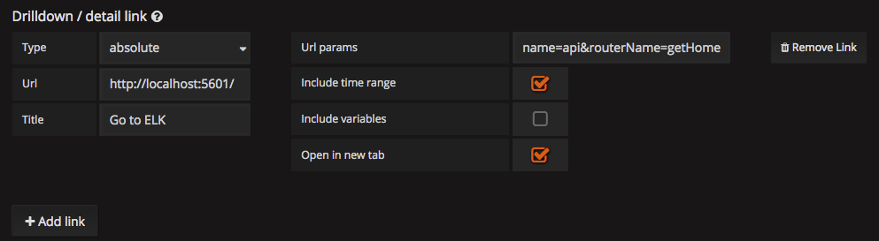
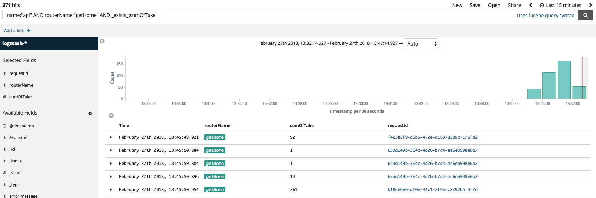
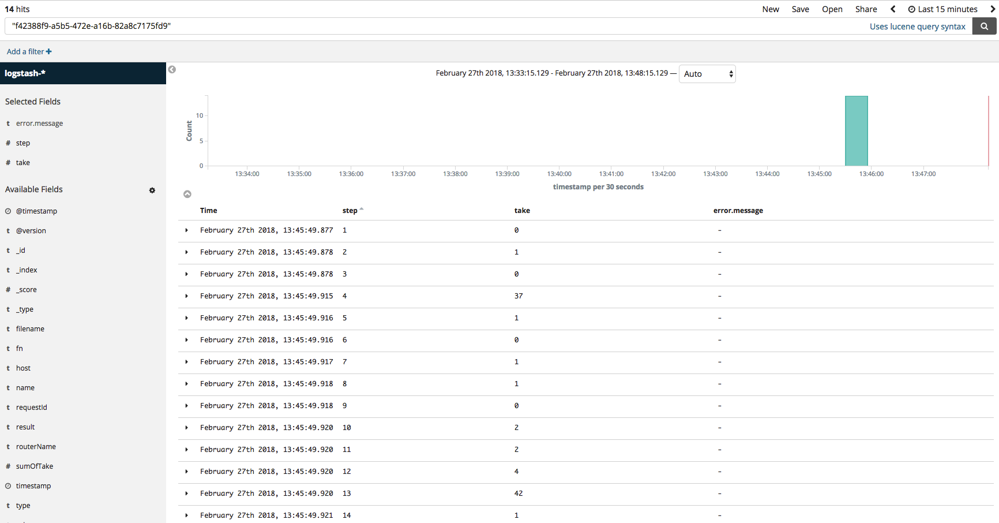
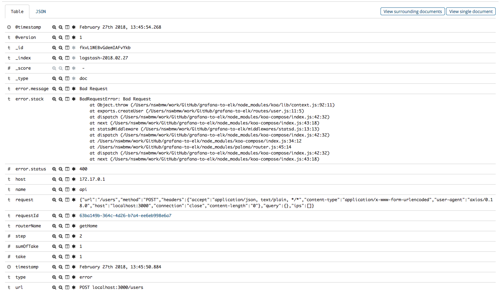
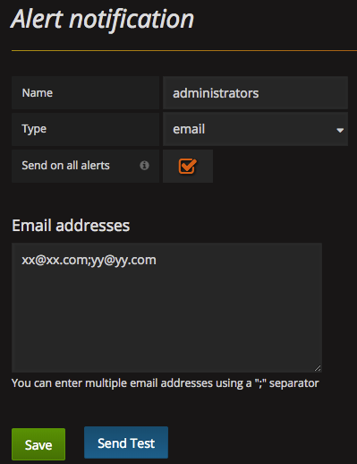
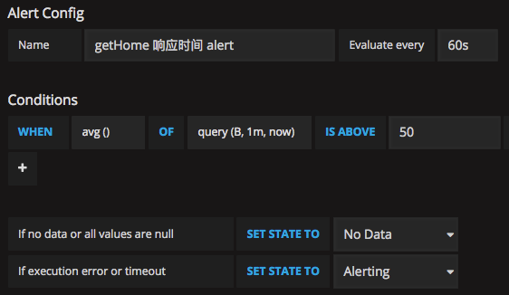
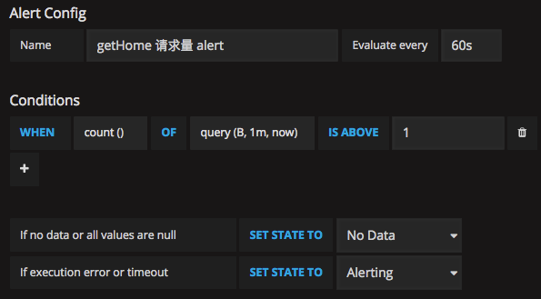
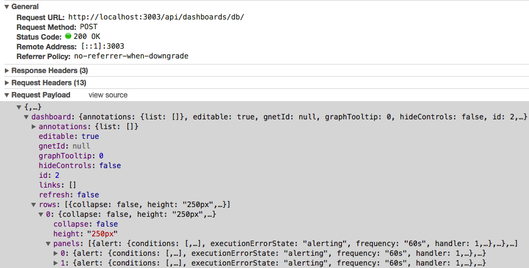

上一小节主要讲解了 Telegraf(StatsD) + InfluxDB + Grafana 的搭建和基本用法，以及创建了请求量和响应时间两种图表。这一小节讲解几个高级用法：

1. 如何将 Grafana（监控） 跟 ELK（日志） 结合起来
2. Grafana 监控报警
3. 脚本一键生成图表

## Grafana + ELK

在观察 Grafana 监控时，发现某个 api 接口响应时间突然有一个尖刺，这个时候想查一查到底是什么原因导致的。前面介绍过 koa-await-breakpoint + ELK 的用法，是否可以结合 Grafana 使用呢？答案是可以的。

因为涉及的代码量大，笔者写了一个 demo 托管到了 GitHub 上，有两个 repo，分别为：

- [grafana-to-elk](https://github.com/nswbmw/grafana-to-elk)：包含 web server 和模拟请求的 client，分别将统计信息发送到 StatsD 和将日志发送到 ELK。
- [grafana-to-elk-extension](https://github.com/nswbmw/grafana-to-elk-extension)：Chrome 扩展，作用是：
  - 格式化从 Grafana 跳转到 ELK 的时间范围
  - 添加 requestId 的链接
  - 高亮显示重要的字段

首先 clone 到本地：

```sh
$ git clone https://github.com/nswbmw/grafana-to-elk.git
$ git clone https://github.com/nswbmw/grafana-to-elk-extension.git
```

测试步骤如下：

1. 按照 7.2 小节启动 Telegraf(StatsD) + InfluxDB + Grafana

2. 按照 6.3 小节启动 ELK

3. 到 grafana-to-elk 目录下运行：
  ```sh
  $ npm i
  $ node server
  ```
  起另外一个终端运行：
  ```sh
  $ node client
  ```
  此时，ELK 应该有日志了。

4. 加载 Chrome 扩展。打开 Chrome 扩展程序页 -> 加载已解压的扩展程序... -> 加载 grafana-to-elk-extension（非测试环境需要修改 manifest.json 的 matches 字段）。

5. 回到 Grafana 的『getHome 响应时间』图表，进入编辑页的 General tab，如下填写：
  
  保存，图表的左上角会出现一个类似分享的按钮，鼠标悬浮到上面出现 Go to ELK，点击跳转到 ELK。

6. ELK 显示如下：
  grafana-to-elk-extension 插件自动处理并跳转到对应 Grafana 中的时间段并且查询出了我们关心的结果。点击第一个 requestId，将会跳转并显示该请求所有的日志，如下所示：
  
  错误请求的日志：
  

## 监控报警

Grafana 有内置的监控报警，设置步骤如下：

1. 进入 Alerting -> Notifications 页，点击 New Notification 添加新的报警组，如下所示：
  
2. 回到『getHome 响应时间』图表，进入编辑页的 Alert tab，点击 Create Alert 创建报警规则，如下所示：
    
  **报警规则**：每 60s 检查一次过去 1min 的 mean（B 在 Metrics 里面代表了别名为 mean 折线图）折线图的平均值是否大于 50，如果是则触发报警。  
  **注意**：如需发邮件，需要设置 Grafana 的 [SMTP settings](http://docs.grafana.org/installation/configuration/#smtp)。

我们还可以给 『getHome 请求量』设置错误报警监控，如下所示：



每 60s 检查一次过去 1min 是否有 400 报错，如果有则触发报警，其中 B 代表了别名为 400 的折线图。 

**Tips**：报警信息可以发送到 Email、Slack、DingTalk 或者 Webhook 等等。报警内容可以包含图表的截图，需要配置 [external image uploader](http://docs.grafana.org/installation/configuration/#external-image-storage)。

## 脚本一键生成图表

我们只创建了一个接口的两种（请求量和响应时间）图表，还要设置 link、alert 等等就很麻烦了。如果我们的 api 有几百个接口，岂不是灾难了。

Grafana 虽然有 Template 的功能，但我们接下来讲一个奇技淫巧。

我们在保存图表的时候从 Chrome DevTools 的 Network 看到发起了一个 Ajax 请求，如下所示：



dashboard 就是包含了当前仪表盘页所有图表的完整 JSON，其中：

- dashboard：包含一到多行 row
- rows：一行 row 包含一到多个 panel
- panels：一个 panel 是一个具体的图表

拿到这个 JSON 我们就可以不断尝试修改它，然后用 axios 带上浏览器拿到的 Cookie 发送到图中的 url，模拟浏览器的保存操作，这里就不再展开讲解了。

## 参考链接

- http://docs.grafana.org/alerting/notifications/

上一节：[7.1 Telegraf + InfluxDB + Grafana(上)](https://github.com/nswbmw/node-in-debugging/blob/master/7.1%20Telegraf%20%2B%20InfluxDB%20%2B%20Grafana(%E4%B8%8A).md)

下一节：[8.1 node-clinic](https://github.com/nswbmw/node-in-debugging/blob/master/8.1%20node-clinic.md)
