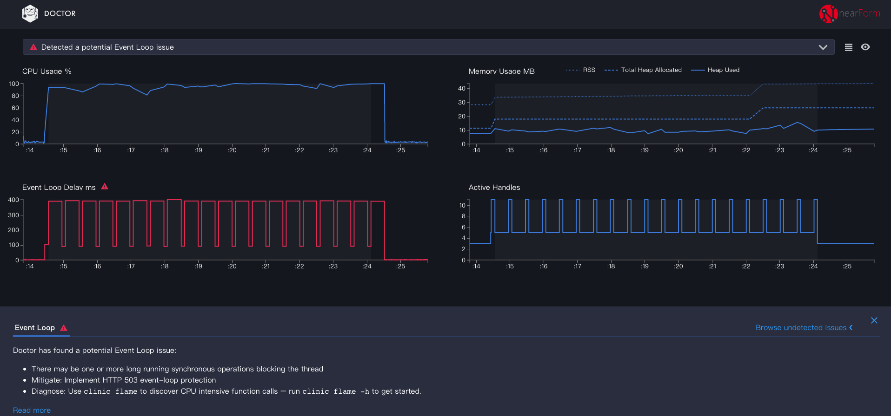
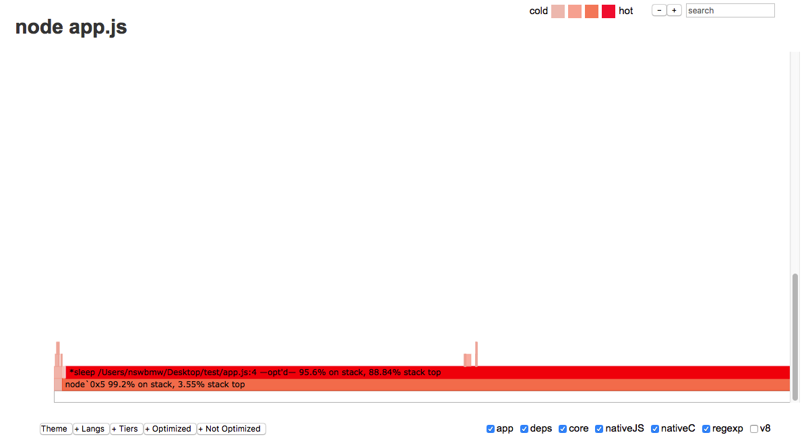

[node-clinic](https://github.com/nearform/node-clinic)（简称 clinic） 是一个开箱即用的 Node.js 应用诊断工具。

首先，安装 Node.js@9+

```sh
$ nvm install 9
```

全局安装 clinic：

```sh
$ npm i clinic -g
```

创建测试代码：

**app.js**

```js
const Paloma = require('paloma')
const app = new Paloma()

function sleep (ms) {
  const future = Date.now() + ms
  while (Date.now() < future);
}

app.use(() => {
  sleep(50)
})

app.listen(3000)
```

使用 clinic doctor 启动并诊断 Node.js 应用：

```sh
$ clinic doctor -- node app.js
```

使用 ab 压测：

```sh
$ ab -c 10 -n 200 "http://localhost:3000/"
```

CTRL+C 终止测试程序，终端打印出：

```
Warning: Trace event is an experimental feature and could change at any time.
^Canalysing data
generated HTML file is 51485.clinic-doctor.html
```

浏览器打开 51485.clinic-doctor.html，如下所示：



**可以看出**：Event Loop 被阻塞，CPU Usage 也居高不下，一定是有 CPU 密集计算，与我们的测试代码吻合。

clinic 也给出了猜测和解决方案，我们尝试使用 clinic flame 生成火焰图：

```sh
$ clinic flame -- node app.js
```

也可以用以下命令代替：

```sh
$ clinic flame --collect-only -- node app.js # 只收集数据
$ clinic flame --visualize-only PID.flamegraph # 将数据生成火焰图
```

使用同样的 ab 命令压测后，生成的火焰图如下：



**可以看出**：app.js 第 4 行的 sleep 函数占用了大量的 CPU 计算。

## 参考链接

- https://www.nearform.com/blog/introducing-node-clinic-a-performance-toolkit-for-node-js-developers/

上一节：[7.2 Telegraf + InfluxDB + Grafana(下)](https://github.com/nswbmw/node-in-debugging/blob/master/7.2%20Telegraf%20%2B%20InfluxDB%20%2B%20Grafana(%E4%B8%8B).md)

下一节：[8.2 alinode](https://github.com/nswbmw/node-in-debugging/blob/master/8.2%20alinode.md)
