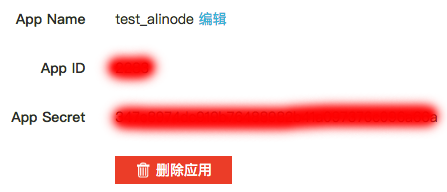
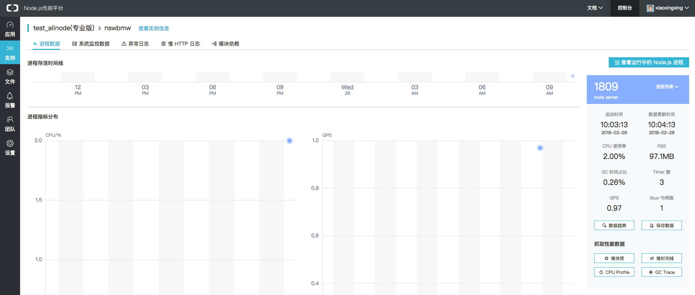
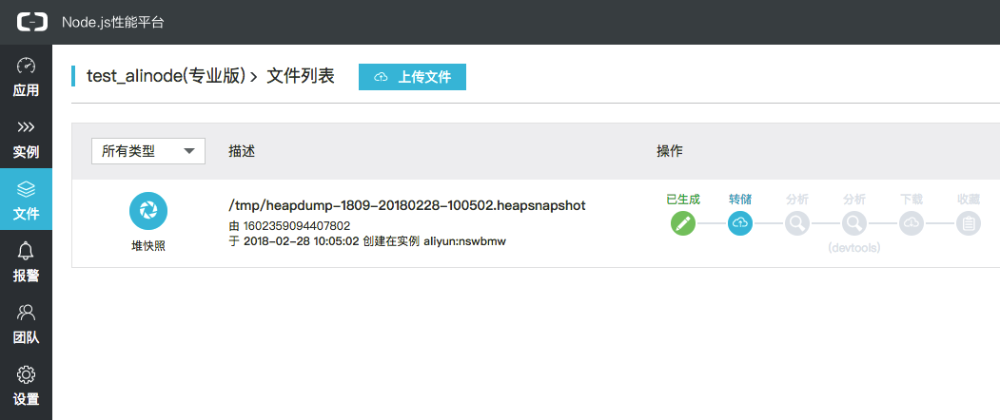
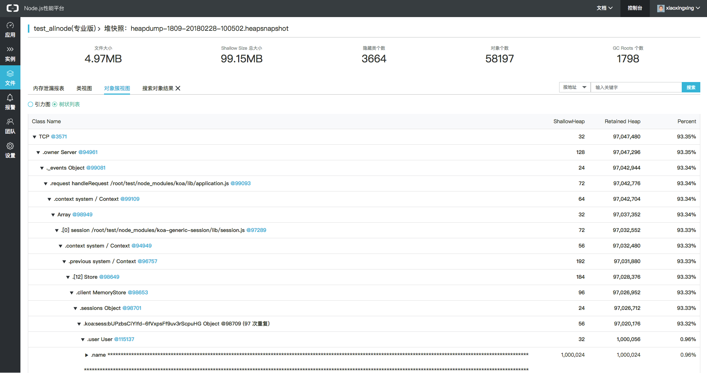
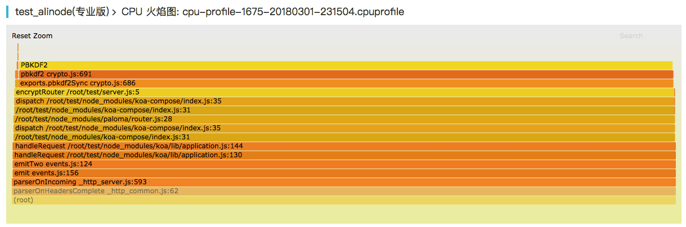
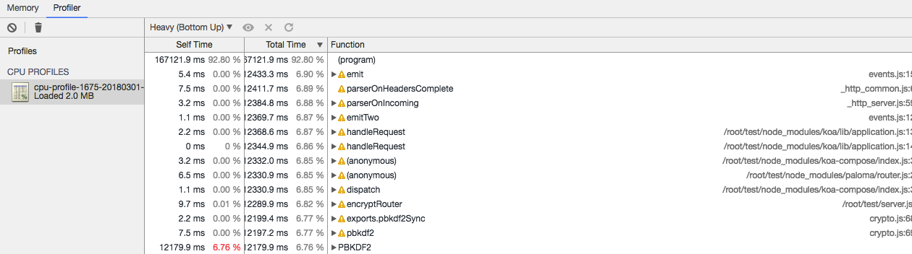

## 什么是 alinode ？

> Node.js 性能平台（原 alinode）是面向中大型 Node.js 应用提供性能监控、安全提醒、故障排查、性能优化等服务的整体性解决方案。alinode 团队凭借对 Node.js 内核深入的理解，提供完善的工具链和服务，协助客户主动、快速发现和定位线上问题。

## 创建 alinode 应用

访问官网 <https://www.aliyun.com/product/nodejs>，如未开通，请使用阿里云账号登录并免费开通即可。

登录后进入[控制台](https://node.console.aliyun.com/)点击『创建新应用』，创建一个名为 test_alinode 的应用。

进入设置页面，如下所示：



App ID 和 App Secret 后面会用到。

## 安装 alinode

alinode 整套服务由 alinode 运行时、agenthub（原 agentx + commdx 命令集）和服务平台组成，所以在自己的服务器上部署时需要安装 alinode 运行时和 agenthub。

我们使用交互式一键安装 alinode 和 agenthub：

```sh
$ uname -a # 阿里云 ECS Ubuntu@16.04
Linux nswbmw 4.4.0-105-generic #128-Ubuntu SMP Thu Dec 14 12:42:11 UTC 2017 x86_64 x86_64 x86_64 GNU/Linux
$ wget https://raw.githubusercontent.com/aliyun-node/alinode-all-in-one/master/alinode_all.sh
$ bash -i alinode_all.sh # App ID 和 App Secret 填写上面生成的
...
$ node -p 'process.alinode' # 查看 alinode 版本
```

**注意**：如果遇到 wget 报错 `wget: unable to resolve host address 'raw.githubusercontent.com'`，需要修改 DNS 配置，在 /etc/resolv.conf 最上面添加 `nameserver 8.8.8.8`。

生成 yourconfig.json 配置文件如下：

```json
{
  "server": "agentserver.node.aliyun.com:8080",
  "appid": "xxx",
  "secret": "xxx",
  "logdir": "/tmp/",
  "reconnectDelay": 10,
  "heartbeatInterval": 60,
  "reportInterval": 60,
  "error_log": [],
  "packages": []
}
```

使用该配置启动 agenthub：

```sh
$ nohup agenthub yourconfig.json &
```

agenthub 将以常驻进程的方式运行。

下面我们通过两个例子使用 alinode 分别调试内存泄露和 CPU 性能瓶颈的问题。

## 使用 alinode 诊断内存泄露

我们以一段内存泄露代码为例，演示如何使用 alinode 调试内存泄漏的问题。代码如下：

**server.js**

```js
const Paloma = require('paloma')
const session = require('koa-generic-session')
const app = new Paloma()

app.keys = ['some secret']
app.use(session())

class User {
  constructor () {
    this.name = new Array(1e6).join('*')
  }
}

app.use((ctx) => {
  ctx.session.user = new User()
  ctx.status = 204
})

app.listen(3000)
```

这段代码内存泄露的原因是：koa-generic-session 默认将 session 信息存储到了内存中。

**client.js**

```js
const axios = require('axios')

setInterval(() => {
  axios.get('http://localhost:3000')
}, 1000)
```

起两个终端分别运行 ：

```sh
$ ENABLE_NODE_LOG=YES node server # 开启 alinode 的 log 功能，使得 agenthub 可以监控内核级的性能数据
$ node client # 1s 发起一次请求
```

过一会就可以在 alinode 控制台看到数据了，如下所示：



可以看出，alinode 监控了：

- 异常日志
- 慢 HTTP 日志
- 模块依赖
- 系统监控数据（包含非常详尽的图表数据）
  - Memory
  - CPU
  - Load
  - QPS
  - GC
  - Apdex
  - Apdex detail
  - node 进程数
  - 磁盘


点击『堆快照』生成一个 heapsnapshot 文件，点击左侧『文件』查看刚才生成的堆快照：



转储后点击『分析』，选择『对象簇视图』的树状列表，展开如下所示：



**可以看出**：MemoryStore 的 sessions 对象中存储了 97 个 session，并且每个 session.user 上有一个 name 字段是长字符串。

## 使用 alinode 诊断 CPU 性能瓶颈

测试代码：

**server.js**

```js
const crypto = require('crypto')
const Paloma = require('paloma')
const app = new Paloma()

app.route({ method: 'GET', path: '/encrypt', controller: function encryptRouter (ctx) {
  const password = ctx.query.password || 'test'
  const salt = crypto.randomBytes(128).toString('base64')
  const encryptedPassword = crypto.pbkdf2Sync(password, salt, 10000, 64, 'sha512').toString('hex')

  ctx.body = encryptedPassword
}})

app.listen(3000)
```

**client.js**

```js
const axios = require('axios')

setInterval(() => {
  const tps = Math.floor(Math.random() * 10)
  for (let i = 0; i < tps; i++) {
    axios.get('http://localhost:3000/encrypt?password=123456')
  }
  console.log(`Sent ${tps} requests`)
}, 1000)
```

起两个终端，分别运行：

```sh
$ ENABLE_NODE_LOG=YES node server
$ node client
```

回到 alinode 控制台，点击『CPU Profile』，然后到『文件』查看刚才生成的 cpuprofile 文件，转储后点击『分析』，可以看到生成的火焰图。展开后如下所示：



**可以看出**：server.js 第 5 行，即 encryptRouter 占用 CPU 较多，而 encryptRouter 里的 exports.pbkdf2Sync 占用了 encryptRouter 绝大部分 CPU 时间。

回到『文件』，选择『devtools 分析』，如下所示：



**可以看出**：alinode 已经帮我们把可疑的 CPU 性能瓶颈的元凶标红显示了。

**Tips**：不管是生成的 heapsnapshot 还是 cpuprofile，都可以选择『下载』后使用 Chrome DevTools 分析。

我们上面演示了『堆快照』和『CPU Profile』的使用，alinode 支持抓取以下 5 种数据：

- 堆快照
- 堆时间线
- CPU Profile
- GC Trace
- Heap Profile

本文就不一一演示了。

alinode 如此强大，而且免费使用，可以说是开发 Node.js 应用必不可少的好伙伴了。

## 参考链接

- https://www.aliyun.com/product/nodejs
- https://github.com/aliyun-node/agenthub
- https://cnodejs.org/topic/561f289b4928c5872abc18ee

上一节：[8.1 node-clinic](https://github.com/nswbmw/node-in-debugging/blob/master/8.1%20node-clinic.md)
